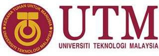
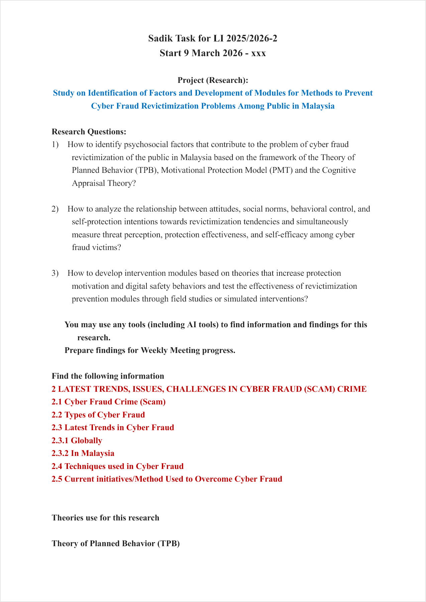
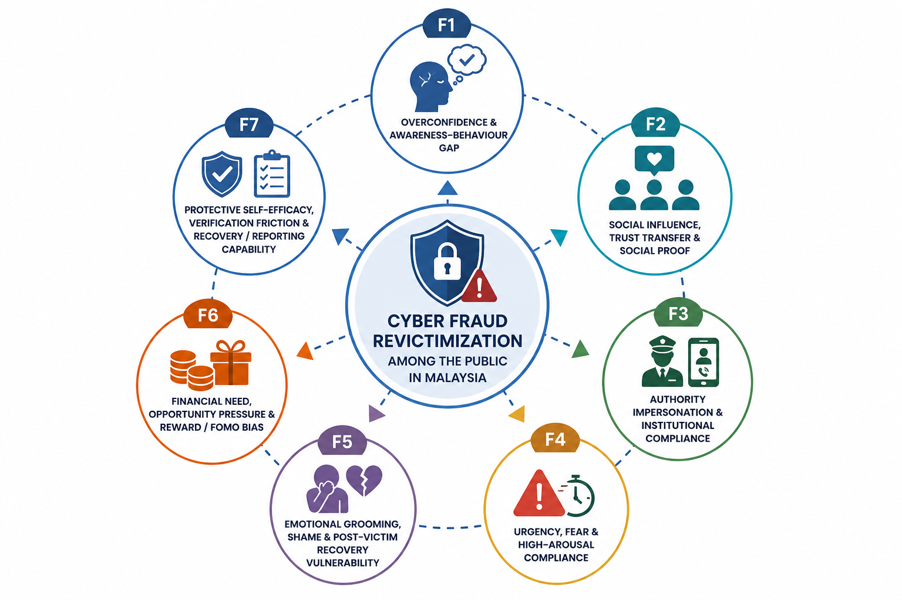
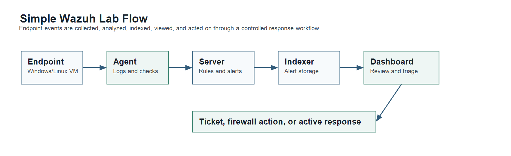

# SCSR4114 Internship-Report

# INDUSTRIAL TRAINING REPORT

Cyber Fraud Revictimization Research at UTM/IASRG

**BY**

**SADIK AL MAHMUD (A20EC4049)**

**BACHELOR OF COMPUTER SCIENCE**

**COMPUTER NETWORK AND SECURITY**

**TRAINING PLACE:**

UTM/IASRG Research Context, Faculty of Computing, Universiti Teknologi Malaysia

**INDUSTRY SUPERVISOR:** Assoc. Prof. Ts. Dr. Siti Hajar Othman

**ACADEMIC SUPERVISOR:** Ts. Dr. Raja Zahilah Binti Raja Mohd Radz

**TRAINING PERIOD:** 09 March 2026 to 24 July 2026

**REPORT DATE:** 2026

<!-- PAGE BREAK -->

# ACKNOWLEDGEMENT

I would like to express my sincere appreciation to Assoc. Prof. Ts. Dr. Siti Hajar Othman for the guidance and supervision given throughout my industrial training. Her guidance helped me understand the assigned cybersecurity research topic, improve the report direction, and complete the required tasks in a more organized way.

I am also thankful to Universiti Teknologi Malaysia, the Faculty of Computing, and the IASRG environment for giving me the opportunity to work in a supervised academic and cybersecurity-related setting. The training helped me improve my research, documentation, technical reading, and project management skills.

Finally, I would like to thank my family and everyone who supported me during the training period. Their support helped me complete the internship work, logbook, research documentation, and this industrial training report.

<!-- PAGE BREAK -->

# ABSTRACT

This report describes my industrial training from 09 March 2026 to 24 July 2026 at UTM/IASRG. The main task assigned during the training was related to the study on identification of factors and development of modules for methods to prevent cyber fraud revictimization problems among the public in Malaysia. The work was carried out at UTM, mainly in the N28 block lab environment, under the supervision of Assoc. Prof. Ts. Dr. Siti Hajar Othman.

During the training, I studied cyber fraud crime, cyber fraud types, scam trends, issues, challenges, techniques, current initiatives, and related theories such as the Theory of Planned Behavior, Protection Motivation Theory, and Cognitive Appraisal Theory. I prepared weekly progress findings, organized sources, developed the research direction, and completed a full six-chapter cyber fraud research report draft. The report work covered introduction, literature review, methodology, intervention module design, data-honest analysis structure, and conclusion. Besides the main research work, I also explored Wazuh, SOC, SIEM, XDR, and cyber threat intelligence concepts. This included studying how Wazuh works, understanding similar security monitoring tools, and attempting basic local setup and testing on my laptop.

The training improved my ability to search, compare, verify, and organize information for a cybersecurity research project. It also helped me understand how research work, technical exploration, and proper documentation support each other in Computer Network and Security.

<!-- PAGE BREAK -->

# ABSTRAK

Laporan ini menerangkan latihan industri saya dari 09 Mac 2026 hingga 24 Julai 2026 di UTM/IASRG. Tugasan utama latihan ini berkaitan dengan kajian pengenalpastian faktor dan pembangunan modul bagi kaedah mencegah masalah reviktimisasi penipuan siber dalam kalangan orang awam di Malaysia. Latihan ini dijalankan di UTM, terutamanya dalam persekitaran makmal di blok N28, di bawah penyeliaan Assoc. Prof. Ts. Dr. Siti Hajar Othman.

Sepanjang latihan, saya mengkaji jenayah penipuan siber, jenis penipuan siber, trend terkini, isu, cabaran, teknik penipuan, inisiatif semasa, dan teori berkaitan seperti Theory of Planned Behavior, Protection Motivation Theory, dan Cognitive Appraisal Theory. Saya menyediakan dapatan kemajuan mingguan, menyusun sumber rujukan, membangunkan hala tuju kajian, dan menyiapkan draf laporan penyelidikan penipuan siber yang lengkap dengan enam bab. Selain tugasan utama tersebut, saya juga meneroka konsep Wazuh, SOC, SIEM, XDR, dan cyber threat intelligence, termasuk memahami cara Wazuh berfungsi serta mencuba tetapan dan pengujian asas secara tempatan pada komputer riba.

Latihan ini membantu saya meningkatkan kemahiran mencari maklumat, menyemak sumber, menulis laporan, mengurus dokumentasi, dan memahami hubungan antara penyelidikan keselamatan siber dengan penerokaan teknikal.

<!-- PAGE BREAK -->

# TABLE OF CONTENTS

[[TOC]]

<!-- PAGE BREAK -->

# CHAPTER 1: INTRODUCTION

## 1.1 Introduction of Training Organization

Universiti Teknologi Malaysia is a public research university that supports teaching, research, innovation, and professional development in engineering, computing, science, and technology. My industrial training was carried out at UTM/IASRG through the Faculty of Computing. The work was related to cybersecurity research, especially cyber fraud revictimization, prevention factors, and module planning.

The training was supervised by Assoc. Prof. Ts. Dr. Siti Hajar Othman. During the internship period, I worked at UTM in the N28 block lab environment. The setting was a supervised working environment where tasks were assigned, reviewed, and improved through reading, progress preparation, report writing, and technical exploration.

## 1.2 Core Training Area

The core training area was cybersecurity research and practical documentation. The main assigned topic was *Study on Identification of Factors and Development of Modules for Methods to Prevent Cyber Fraud Revictimization Problems Among Public in Malaysia*. This topic required me to understand cyber fraud crime, scam methods, victim behaviour, repeated victimization, and possible prevention methods.

The work involved more than collecting information. It also required arranging sources, preparing weekly findings, developing research chapters, studying related theories, planning intervention module ideas, and exploring cybersecurity tools that could support technical understanding.

## 1.3 Organization Activity

The training activities were connected to academic research, cybersecurity knowledge development, and research documentation. The main activities included studying cyber fraud cases, identifying trends and challenges, comparing scam techniques, reviewing existing prevention initiatives, and relating the findings to behavioural and protection theories.

The UTM/IASRG environment supported this work through supervisor direction, task progress review, and report preparation. The work was handled like a supervised project assignment, with feedback used to improve each output.

## 1.4 Organization Structure

The detailed organization chart is not included because the confirmed structure was not provided in the available materials. For this report, the practical reporting structure can be described as Universiti Teknologi Malaysia, Faculty of Computing, UTM/IASRG work context, industry supervisor, academic supervisor, and student intern.

This reflects the actual reporting flow during the training. Task direction and review came from the supervisor, while the daily work was completed through reading, analysis, drafting, technical exploration, and documentation.

## 1.5 Practical Training Division Information

The practical training work was conducted in a research and cybersecurity-related environment. The main focus was to complete assigned research tasks and prepare supporting materials for a cyber fraud revictimization study. The training also included Wazuh and SOC exploration as a supporting task.

The work required self-management because research tasks often involve reading many sources, checking their quality, and rewriting sections more than once before they become useful for a report.

## 1.6 Training Program

The training program was arranged around the assigned research topic and related cybersecurity tasks. The main work included understanding the research title, finding information on cyber fraud trends and techniques, studying TPB, PMT, and Cognitive Appraisal Theory, preparing weekly progress findings, drafting research report chapters, and organizing references and evidence.

Around the middle stage of the training, I also worked on Wazuh and SOC-related exploration. This involved studying how Wazuh works, understanding other related applications, attempting setup and testing on my laptop, and preparing analysis notes on its possible use as a SIEM/XDR-related security monitoring tool.

## 1.7 Conclusion

This chapter introduced the organization and training context at UTM/IASRG, with the main focus on cyber fraud revictimization research and supporting cybersecurity learning.

<!-- PAGE BREAK -->

# CHAPTER 2: SPECIFIC DETAILS ON PROJECTS / TRAINING

## 2.1 Introduction

This chapter explains the main project and training tasks completed during the industrial training period. The main project was a cybersecurity research task on cyber fraud revictimization among the public in Malaysia. The work included topic understanding, literature search, theory study, issue and trend analysis, report drafting, prevention module planning, and supporting technical exploration.

The internship also included side tasks and supporting tasks, as usually happens in a real training environment. However, the main direction remained the research topic assigned by the supervisor.

## 2.2 Assigned LI Task

The assigned LI task document stated that the project was a research project on cyber fraud revictimization. It listed the main research questions and required me to find information on latest trends, issues, challenges, types of cyber fraud, techniques used in cyber fraud, current initiatives, and theories for the research.

*Figure 2.1: Initial LI task page for the assigned cyber fraud revictimization research.*

<!-- PAGE BREAK -->

The task document became the starting point for the internship work. It helped define the main project direction and the weekly progress work expected during the training.

## 2.3 Main Project Title

The main project title was *Study on Identification of Factors and Development of Modules for Methods to Prevent Cyber Fraud Revictimization Problems Among Public in Malaysia*. The purpose of the work was to study why people may become victims again after scam exposure or victimization, and how prevention modules can be designed to reduce that risk.

The project required both cybersecurity understanding and behavioural research understanding. Cyber fraud is not only a technical issue because many scams depend on trust, pressure, social influence, fake authority, urgency, fear, and weak verification habits. Because of that, the research also considered psychological and behavioural theories.

## 2.4 Main Research Work

The early work focused on understanding the topic and arranging the research direction. I studied the meaning of cyber fraud, scam crime, victimization, and revictimization. I also reviewed scam types such as phishing, smishing, vishing, investment scams, job scams, loan scams, love scams, e-commerce fraud, malicious APK scams, and recovery scams.

After that, I collected information on latest trends, issues, and challenges in cyber fraud. This included local and global developments, scam techniques, reporting channels, current initiatives, and the difficulty of preventing repeated victimization. The information was organized into notes and weekly progress materials.

The research also required theory study. I studied the Theory of Planned Behavior, Protection Motivation Theory, and Cognitive Appraisal Theory. These theories helped explain how attitudes, social influence, perceived control, threat appraisal, coping belief, emotion, and self-protection intention can relate to scam behaviour and revictimization risk.

<!-- PAGE BREAK -->

## 2.5 Cyber Fraud Research Report Development

During the training, I developed the cyber fraud research work into a structured six-chapter research report draft. The report included the introduction, literature review, research methodology, research design and intervention module, results and analysis structure, and conclusion.

The research report was prepared carefully because actual survey and intervention data were not available yet. Because of that, the analysis chapter was written in a data-honest way. It explains how the results should be analysed later, but it does not add unsupported numerical results or unsupported findings. This helped me understand the importance of writing research claims accurately.

*Figure 2.2: Seven-factor framework used in the cyber fraud revictimization research report.*

<!-- PAGE BREAK -->

## 2.6 Wazuh and SOC Exploration

The Wazuh-related task was done as supporting cybersecurity work around the middle stage of the training. I studied Wazuh as an open-source security monitoring platform related to SIEM and XDR. I also studied SOC workflow, cyber threat intelligence concepts, endpoint monitoring, log collection, alerting, dashboards, and the role of security monitoring tools.

The work focused on analysis, understanding similar applications, and attempting basic local setup and testing on my laptop. This helped me understand how Wazuh collects endpoint information, sends it to a server, indexes alerts, and displays them through a dashboard for review.

*Figure 2.3: Simple Wazuh lab flow studied during the supporting technical task.*

## 2.7 Hardware and Software Used

The main hardware used during the training was my laptop. The main software and materials included web browsers, Microsoft Word, Markdown files, spreadsheet-style evidence lists, Wazuh documentation, Wazuh local setup components, cybersecurity references, academic papers, official reports, and research notes.

AI-assisted tools were used only as support for idea searching, comparison, and drafting. Final information still needed checking against proper sources, task requirements, and supervisor direction.

## 2.8 Task Duration

The training period was from 09 March 2026 to 24 July 2026. Most of the training time was spent on the cyber fraud revictimization research topic, including source collection, theory study, weekly progress findings, report drafting, evidence organization, and module planning.

The Wazuh-related task was not the main daily task from the beginning. It was explored around the middle stage of the training as a supporting cybersecurity task. Some days were used to study, set up, test, and analyse Wazuh, while the main research work continued as the core training activity.

## 2.9 Challenges and Management

One challenge was that cyber fraud is a broad topic. At the beginning, many materials were related to general scam awareness, but not all of them supported the revictimization focus. To manage this, I narrowed the work toward repeated victimization, protection intention, behavioural factors, verification behaviour, and prevention modules.

Another challenge was source quality. Some sources were useful for examples, but not strong enough for main research claims. I managed this by separating official, academic, news, technical, and supporting sources.

The Wazuh task also had practical challenges because setup and testing on a laptop required understanding several components. I managed this by treating it as a learning and analysis task within a laptop-based test environment.

<!-- PAGE BREAK -->

# CHAPTER 3: OVERALL INFORMATION OF THE INDUSTRIAL TRAINING

## 3.1 Learnings

The industrial training gave me useful experience in handling a real assigned research task. I learned that research work requires continuous reading, comparison, rewriting, and checking. A topic may look simple at the beginning, but it becomes clearer only after the sources, theories, and actual research questions are arranged properly.

From the technical side, I learned about cyber fraud, scam methods, SOC workflow, SIEM, XDR, cyber threat intelligence, and Wazuh. The Wazuh task helped me understand how a security monitoring platform collects information, supports dashboards, and helps users review alerts or endpoint activity.

From the research side, I learned how TPB, PMT, and Cognitive Appraisal Theory can support cybersecurity prevention research. These theories helped me connect scam behaviour with attitude, social influence, perceived control, threat perception, coping belief, emotion, and protection motivation.

## 3.2 Skills Gained

The main skills gained during the training were research reading, source selection, summarising, report writing, theory mapping, technical analysis, and documentation. I also improved my ability to manage files, prepare progress notes, and explain technical topics in a clearer way.

The training improved my time management. Some days were used for deep reading, some days for rewriting, and some days for checking smaller issues such as references, formatting, or evidence organization. This helped me understand that internship work is not always fixed in one straight path, but the overall progress still needs to be controlled properly.

## 3.3 Constructive Comments

The training was useful because it gave me a real cybersecurity research assignment under academic guidance. The task helped me understand how research work is planned, improved, and documented in stages. The supervisor's direction was important because it helped keep the work focused on the assigned topic.

<!-- PAGE BREAK -->

One area that can be improved is having a clearer early structure for large research tasks. A broad topic can take time to understand, so having a simple early roadmap can help interns organize the work faster. At the same time, the process of adjusting the topic and improving the structure gave me practical experience.

## 3.4 Professional Development

This training helped me develop better documentation habits. I learned that research notes, references, evidence, report drafts, Wazuh analysis notes, logbook entries, and official internship documents need to be separated clearly. This made the later report preparation easier and helped me avoid mixing the research report with the internship report.

The training also helped me become more careful with technical claims. For example, when writing about Wazuh, it was more accurate to state that I studied it, analysed similar tools, understood how it works, and attempted basic local setup and testing. This made the documentation more realistic and professional.

## 3.5 Conclusion

Overall, the industrial training improved both technical and research-related skills. It gave me experience in cyber fraud research, prevention module planning, Wazuh/SOC exploration, evidence handling, and formal report preparation.

<!-- PAGE BREAK -->

# CHAPTER 4: CONCLUSION

## 4.1 Overall Achievement

The industrial training allowed me to complete meaningful work at UTM/IASRG. The main achievement was progressing the cyber fraud revictimization research topic from initial understanding to organized findings, theory mapping, research report drafting, analysis structure, and prevention module planning.

I also gained supporting technical knowledge through Wazuh and SOC exploration. This helped me connect the research topic with practical cybersecurity monitoring concepts, even though the main project remained focused on cyber fraud revictimization and prevention.

## 4.2 Issues and Challenges During LI

The main issue during the training was managing a broad cybersecurity research topic. Cyber fraud includes many scam types, technical methods, psychological factors, and prevention initiatives. To handle this, I focused on revictimization, behavioural factors, protection motivation, verification behaviour, and intervention module planning.

Another challenge was arranging the research materials into a proper report structure. Some information was useful only as background, while other information was suitable for the main argument. I managed this by improving the report structure, organizing sources, and checking whether each section supported the assigned topic.

For the Wazuh task, the challenge was understanding the setup and components within a limited laptop-based test environment. I treated it as an analysis and learning task, which made the work more realistic and accurate.

## 4.3 Opinion and Suggestions

In my opinion, this industrial training was helpful because it gave me experience in both cybersecurity research and technical exploration. The work improved my ability to understand a problem, search for reliable information, prepare findings, and organize a report.

<!-- PAGE BREAK -->

For future improvement, the cyber fraud revictimization research can be expanded with a completed questionnaire, collected survey data, and module evaluation. The Wazuh analysis can also be continued later if there is a need to study security monitoring in a more complete environment with proper resources and supervision.

## 4.4 Final Conclusion

In conclusion, the industrial training helped me apply Computer Network and Security knowledge in a supervised work environment. I gained experience in cyber fraud research, behavioural theory study, report drafting, Wazuh/SOC analysis, prevention module planning, and internship documentation. These skills are valuable for my future work in cybersecurity and research-related tasks.

<!-- PAGE BREAK -->

# REFERENCES AND WORK MATERIALS

This report was prepared based on the LI task document, weekly progress work, cyber fraud research notes, Wazuh analysis notes, research report drafts, evidence and reference files, logbook preparation, and official internship report guidelines.

Key work materials used during the training include:

1. Initial LI task document for cyber fraud revictimization research.
2. Cyber fraud research report draft: *Study on Identification of Factors and Development of Modules for Methods to Prevent Cyber Fraud Revictimization Problems Among Public in Malaysia*.
3. Wazuh security analysis report and local testing notes.
4. Final logbook and internship documentation files.
5. Official, academic, and technical sources used for cybersecurity research and documentation.

<!-- PAGE BREAK -->

# APPENDICES

## Appendix A: Assigned LI Task

The main assigned task was the cyber fraud revictimization research topic at UTM/IASRG.

## Appendix B: Research Work Materials

The research work materials include topic notes, source lists, theory notes, report chapters, evidence organization, and module-planning ideas.

## Appendix C: Wazuh Analysis Notes

The Wazuh analysis notes record the supporting study on Wazuh, SOC, SIEM, XDR, CTI, local setup attempt, and technical understanding.

## Appendix D: Internship Documentation

The internship documentation includes the final logbook, folder organization, Markdown report source, and final industrial training report document.
