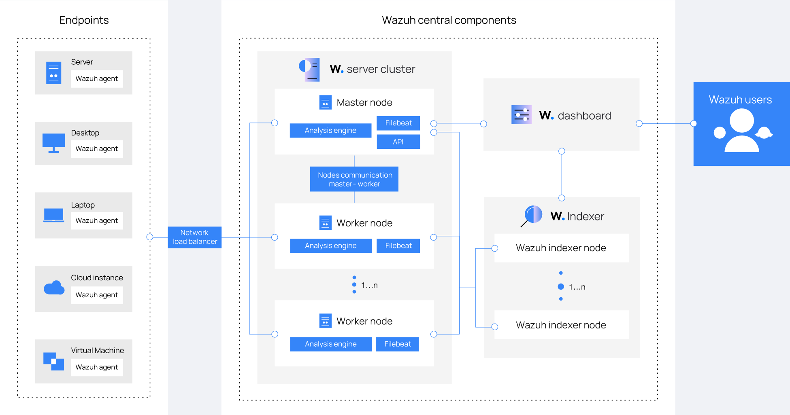
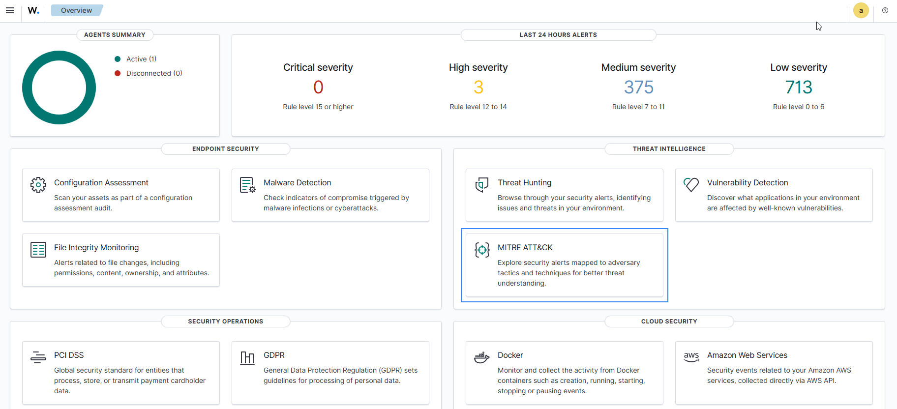
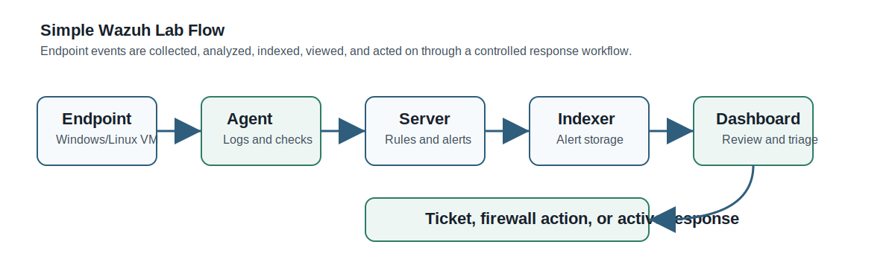
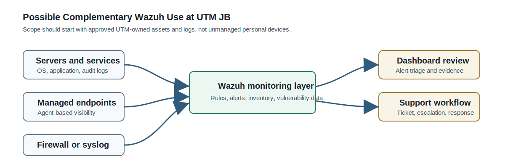

# Wazuh Security Report

Prepared date: 02 July 2026  
Purpose: Practical security-monitoring analysis for the Wazuh/SOC feasibility working record.  
Status: Working report for review. The earlier detailed analysis file is retained separately as reference material.

## 1. Overview of Wazuh

Wazuh is an open-source security platform used for endpoint and workload monitoring. It combines functions normally associated with SIEM, XDR, and host-based intrusion detection. Its main job is to collect events, analyze them through rules and decoders, generate alerts, keep searchable evidence, and help security teams investigate activity across servers, endpoints, cloud workloads, and selected network sources.

Wazuh has a clear OSSEC background because the older OSSEC HIDS model focused on log analysis, file integrity monitoring, malware detection, compliance auditing, and active response. Wazuh expands that style into a wider platform with central indexing, dashboards, vulnerability detection, security configuration checks, integrations, and MITRE ATT&CK mapping. Wazuh, Inc. states that the company began in 2015, and its public team page lists Santiago Bassett as Founder and CEO.

The self-hosted Wazuh platform has no software license fee. Its official quickstart describes Wazuh as free and open source under GPLv2 and Apache License 2.0 components. Wazuh Cloud is the paid managed option where Wazuh operates the hosted environment and handles cloud-side updates, health checks, and support.

| Platform | Type | Main fit | Cost model |
|---|---|---|---|
| Wazuh | Open-source SIEM/XDR/HIDS platform | Endpoint, server, workload, compliance, and log monitoring | Self-hosted software license cost is USD 0; Wazuh Cloud is paid |
| Security Onion | Open-source security monitoring distribution | Network security monitoring, threat hunting, packet/log analysis | Free software, infrastructure and support cost remain |
| Elastic Security | SIEM and endpoint/security analytics | Search-heavy security analytics and Elastic stack users | Free and paid tiers |
| Graylog Security | Log management and security analytics | Central log review, alerting, and operations visibility | Free and paid tiers |
| Microsoft Sentinel | Cloud-native SIEM/SOAR | Azure/Microsoft 365-centered environments | Paid by ingestion, retention, and related Azure usage |
| Splunk Enterprise Security | Enterprise SIEM | Large enterprise SOC and mature correlation workflows | Paid enterprise licensing |
| IBM QRadar | Enterprise SIEM | Large environments needing mature SIEM correlation and compliance | Paid enterprise licensing |

## 2. Main Features and Facilities



Wazuh works through a central architecture. Agents send endpoint events to the Wazuh server. The server applies rules and creates alerts. Filebeat sends alert and event data to the Wazuh indexer, and the Wazuh dashboard is used for viewing, filtering, and investigation.

| Facility | Practical purpose |
|---|---|
| Agent-based endpoint monitoring | Collects security events from Windows, Linux, macOS, and other supported systems |
| Log collection and syslog | Receives operating system, application, and selected network/security device logs |
| File integrity monitoring | Detects changes to important files, folders, and registry areas |
| Vulnerability detection | Uses inventory and vulnerability data to highlight exposed software packages |
| Security configuration assessment | Checks systems against hardening and configuration policies |
| Rules, decoders, and alerting | Converts raw events into usable alerts with severity and context |
| MITRE ATT&CK mapping | Groups relevant alerts against known adversary techniques |
| Compliance support | Helps collect evidence for controls such as PCI DSS, GDPR, HIPAA, NIST, and CIS |
| Integrations and active response | Supports external enrichment, ticketing-style workflows, and controlled response actions |

Wazuh should be treated as a monitoring and response-support platform. It is not a complete firewall, antivirus, EDR replacement, ticketing system, or security policy by itself. It can show suspicious activity, preserve evidence, and trigger limited actions when configured, but blocking and remediation normally depend on active response rules, firewalls, endpoint controls, account management, and analyst approval.

## 3. Threats and Practical Use Cases



Wazuh is useful where security events need to be collected and reviewed from many systems. Its strongest value appears when endpoint logs, server logs, vulnerability findings, and selected network/syslog events are connected into one investigation view.

| Threat or situation | How Wazuh helps |
|---|---|
| Brute-force login attempts | Detects repeated failed login events and raises alerts with user, host, and source details |
| Suspicious file changes | Reports changes in monitored paths, system files, application folders, or registry areas |
| Vulnerable software packages | Identifies exposed packages after inventory and vulnerability matching |
| Malware-check workflow | Supports workflows using integrations such as VirusTotal, YARA, ClamAV, or Windows Defender logs |
| Privilege or account changes | Alerts on account creation, group membership changes, sudo usage, and other audit events |
| Firewall or gateway log review | Receives syslog where approved and supports central searching of network security events |
| Endpoint visibility | Shows asset inventory, operating system details, open ports, processes, and selected system state |

A realistic case is repeated failed login activity on a Linux or Windows server. Wazuh receives the event from the agent, matches it with a rule, assigns severity, and places the alert in the dashboard. The analyst reviews the source address, target account, time pattern, and affected host. The next action may be a firewall block, account lock, password reset, ticket escalation, or an active response rule. Wazuh supports detection and evidence handling; prevention depends on the response controls connected to it.

Community troubleshooting discussions are useful for practical notes such as agent enrollment, noisy alert tuning, storage growth, and connectivity checks. These sources should not replace official documentation for architecture, licensing, installation, or security claims.

## 4. Setup and Deployment



The central Wazuh components are the Wazuh server, Wazuh indexer, and Wazuh dashboard. The Wazuh agent runs on endpoints and sends collected events back to the server. For a lab or first pilot, the official all-in-one installation is the simplest option because all central components run on the same Linux host.

| Component | Role |
|---|---|
| Wazuh agent | Collects endpoint events, inventory, file changes, and security data |
| Wazuh server | Receives agent data, applies decoders and rules, and manages agents |
| Wazuh indexer | Stores and indexes alerts/events for searching and dashboard use |
| Wazuh dashboard | Provides the web interface for monitoring, filtering, and investigation |

Common default ports include TCP 1514 for agent communication, TCP 1515 for agent enrollment, TCP 55000 for the Wazuh server API, TCP 9200 for the indexer API, TCP 443 for the web interface, and UDP/TCP 514 where syslog collection is enabled. These ports should be limited to approved network paths only.

| Deployment size | Suggested starting resources |
|---|---|
| Small lab, 1-25 agents | 4 vCPU, 8 GiB RAM, 50 GB storage for about 90 days of indexed alerts |
| Quickstart, 25-50 agents | 8 vCPU, 8 GiB RAM, 100 GB storage for about 90 days of indexed alerts |
| Quickstart, 50-100 agents | 8 vCPU, 8 GiB RAM, 200 GB storage for about 90 days of indexed alerts |
| Pilot with retention and tuning | Extra storage, backup plan, restricted admin access, and alert review time |

Basic lab process:

1. Prepare a supported 64-bit Linux VM or server, normally Ubuntu Server or another supported Linux distribution.
2. Install the Wazuh central components using the official all-in-one assistant.
3. Open the Wazuh dashboard and store the generated administrator credentials securely.
4. Enrol one or two test agents from Windows or Linux endpoints.
5. Review inventory, security configuration assessment, file integrity monitoring, and vulnerability findings.
6. Generate safe test events, such as failed login attempts or a controlled file change in a monitored folder.
7. Tune noisy alerts and document response steps before adding more systems.

```bash
curl -sO https://packages.wazuh.com/4.14/wazuh-install.sh
sudo bash ./wazuh-install.sh -a
```

The all-in-one installation is suitable for understanding and basic testing. A larger environment should use distributed deployment, role separation, backup planning, storage sizing, access control, certificate handling, and change management.

## 5. Cost, Maintenance, Pros and Cons

Self-hosted Wazuh does not require a Wazuh software license payment, but it is not cost-free in operation. Server resources, storage, backup, administrator time, tuning, and analyst review still carry cost. Wazuh Cloud reduces infrastructure maintenance by shifting the hosted environment to Wazuh, but it becomes a monthly subscription.

| Option | Cost idea | Notes |
|---|---|---|
| Self-hosted Wazuh | USD 0 software license | Server, storage, backup, maintenance, and staff time remain |
| Wazuh Cloud Small | Starting at USD 571/month for up to 100 active agents | 1 month indexed retention, 3 months archive retention, standard support |
| Wazuh Cloud Medium | Starting at USD 923/month for up to 250 active agents | 3 months indexed retention, 1 year archive retention, standard support |
| Wazuh Cloud Large | Starting at USD 1467/month for up to 500 active agents | 3 months indexed retention, 1 year archive retention, standard support |
| Commercial SIEM/SOC platform | Vendor and usage dependent | May include stronger managed workflows, support, or enterprise integrations |

Main maintenance areas are software updates, indexer/storage health, backups, certificate and password management, agent enrollment, rule tuning, noisy alert reduction, dashboard access control, and response procedure review. Without tuning, a Wazuh deployment can become noisy and difficult to operate.

| Pros | Cons |
|---|---|
| No self-hosted license fee | Requires technical administration and storage planning |
| Broad endpoint and server visibility | Alert tuning is necessary to reduce noise |
| Strong documentation and active community | Not a full firewall, antivirus, or EDR replacement |
| Useful for lab, SOC learning, and security evidence | Production-scale use needs sizing, backup, and trained reviewers |
| Flexible integrations and custom rules | BYOD and personal-device monitoring needs policy, consent, and privacy control |

## 6. UTM JB Suitability



Public UTM Digital pages show that UTM has ICT security services, Next Generation Firewall related functions, URL filtering, application control, an Intruder Prevention System listing, data centre services, and a formal support route through SISPAA. The public Data Centre page states that the UTM Data Center supports more than 350 physical servers and has ANSI/TIA-942:2017 build-up and design certification. A public Sangfor case study also describes UTM use of Sangfor IAG for secure web gateway style functions, including URL filtering, application control, traffic management, malware detection, and reporting.

UTM's exact current internal SIEM/SOC stack is not publicly confirmed. Because of that, Wazuh should be positioned carefully as a possible complementary visibility layer, not as a direct replacement claim. If a paid security platform already exists, the practical starting point would be a controlled pilot for selected systems.

| Possible UTM source | Suitability for Wazuh |
|---|---|
| UTM-owned servers and services | High suitability for agent and log monitoring |
| Managed staff or administrative endpoints | Suitable if device ownership, policy, and consent are clear |
| Firewall, gateway, or syslog sources | Suitable where log export is approved and properly scoped |
| Data centre systems | Good pilot value for visibility, audit evidence, and vulnerability review |
| Student BYOD devices | Not suitable as an early scope without strong policy and privacy controls |
| SISPAA/support workflow | Possible manual linkage first, with integration considered after process maturity |

For UTM JB, Wazuh could help with server visibility, endpoint evidence, login monitoring, configuration review, vulnerability awareness, and SOC-style learning in a lab or controlled operational pilot. It would not replace a secure web gateway, firewall, endpoint protection, or existing ticket workflow. The strongest fit is selected UTM-owned assets where logs and agents can be managed properly.

## 7. Final Assessment

Wazuh fits well as an open-source monitoring, alerting, evidence, vulnerability, and compliance-support platform. It is especially useful for understanding how endpoint and server activity can be centralized and reviewed in a SOC-style workflow. It also gives a practical path for a lab setup because the all-in-one installation can be tested with a small number of agents before wider planning.

Its limitations are also clear. Wazuh does not automatically secure an environment by itself. Strong results require approved data sources, proper network access, tuned rules, sufficient storage, backup, analyst review, response procedures, and integration with existing controls. For a university environment, the safest next step is a small lab or limited pilot using selected owned systems, documented retention, and a clear response process.

### Sources checked

- Wazuh architecture: https://documentation.wazuh.com/current/getting-started/architecture.html
- Wazuh quickstart and hardware requirements: https://documentation.wazuh.com/current/quickstart.html
- Wazuh capabilities: https://documentation.wazuh.com/current/user-manual/capabilities/index.html
- Wazuh MITRE ATT&CK documentation: https://documentation.wazuh.com/current/user-manual/ruleset/mitre.html
- Wazuh malware and VirusTotal proof of concept: https://documentation.wazuh.com/current/proof-of-concept-guide/detect-remove-malware-virustotal.html
- Wazuh Cloud pricing: https://wazuh.com/cloud/
- Wazuh release notes: https://documentation.wazuh.com/current/release-notes/index.html
- Wazuh company and team pages: https://wazuh.com/about-us/ and https://wazuh.com/our-team/
- OSSEC official site: https://www.ossec.net/
- UTM Digital ICT Security: https://digital.utm.my/ict-security/
- UTM Digital Data Centre: https://digital.utm.my/data-centre/
- UTM Digital main and support pages: https://digital.utm.my/ and https://digital.utm.my/support/
- Sangfor public UTM success story: https://www.sangfor.com/success-stories/universiti-teknologi-malaysia-utm
- Community/practical references reviewed for troubleshooting context: Wazuh Reddit, Wazuh Google Groups, Stack Overflow, Server Fault, and Wazuh GitHub discussions.
