# Cyber Fraud Revictimization in Malaysia: A Secondary-Data Analysis and Prevention Framework Development Study

## Abstract

Cyber fraud remains a public-facing cybersecurity, financial-safety and behavioural-risk problem in Malaysia. Official incident reports, police alerts, regulator guidance and academic studies show that scam exposure is not limited to one method or one platform. It appears through phishing, impersonation, investment deception, job offers, social proof, malicious application prompts, urgent payment requests and fake support channels. This research examines cyber fraud revictimization as a secondary-data and framework-development study. The study does not treat cyber fraud only as a lack of awareness. Instead, it examines how repeated exposure and repeated unsafe compliance can be influenced by trust transfer, authority cues, urgency, emotional pressure, financial need and low confidence in verification or reporting.

The research used official Malaysian cyber fraud evidence, Cyber999/MyCERT quarterly incident reports, public warning material from enforcement and regulatory bodies, and selected open-access academic literature. The study developed a seven-factor revictimization framework and translated it into scenario scoring, prevention module design, reporting-tool mapping and evidence-supported analysis. The output is a complete research framework supported by secondary data, source coding and descriptive analysis. The study contributes a structured way to connect cyber fraud evidence, behavioural theory and practical public protection activities.

---

# CHAPTER 1: INTRODUCTION

## 1.1 Introduction

Cyber fraud has become one of the most visible cyber safety issues affecting the public. It does not always require advanced hacking against the victim's device. Many cases depend on deception, pressure, trust, official-looking messages, attractive financial promises and fast decision-making. This makes cyber fraud both a cybersecurity problem and a human decision problem. A person may understand that scams exist, but still respond when the message appears urgent, familiar, official or emotionally convincing.

This research focuses on cyber fraud revictimization. Revictimization refers to repeated exposure to harmful scam situations or repeated unsafe responses after earlier scam contact or victimization. In this context, the problem is not only the first fraud attempt. The problem also includes repeated clicking, repeated payment, continued engagement, delayed reporting, recovery-scam exposure, or lack of confidence in checking official channels. The study develops a research framework that connects official evidence, behavioural theory and practical prevention design.

## 1.2 Problem Background

Official Malaysian sources show that fraud-related cyber incidents remain a major handled-incident category. Cyber999 quarterly reports from CyberSecurity Malaysia recorded fraud as the dominant category across several quarters from 2024 to 2025. The Q2 2025 report recorded 2,058 total cyber incidents handled by Cyber999, with 1,633 fraud incidents. The Q4 2025 report recorded 1,881 total incidents and 1,471 fraud incidents. These values do not represent all police cases or all national financial losses, but they show a consistent reporting pattern in public-facing cyber incident handling.

At the same time, public warning pages from PDRM, NSRC, Semak Mule, Bank Negara Malaysia and the Securities Commission Malaysia show that scams are not restricted to one technique. Common patterns include mule-account use, fake investment platforms, job-task scams, impersonated authorities, suspicious URLs, fake documents, urgent payment instructions and recovery approaches. These warnings are important, but warnings alone may not be enough if a person does not know how to pause, verify, refuse, report or recover safely.

The research problem is therefore practical. Cyber fraud prevention often tells users to be careful, but the unsafe action usually happens in a pressured moment. A stronger framework is needed to explain which factors increase revictimization risk and how those factors can be turned into measurable scenario tasks and prevention modules.

## 1.3 Research Aim

The aim of this research is to identify the main factors associated with cyber fraud revictimization among the public in Malaysia and to develop an evidence-based prevention framework that supports scam recognition, safe decision-making, verification, reporting and recovery resistance.

## 1.4 Research Questions

The research questions are:

1. What behavioural, social, emotional, financial, authority-based and practical protection factors are associated with cyber fraud revictimization risk?
2. How can official Malaysian cyber fraud evidence and academic literature be organized into a structured revictimization framework?
3. How can the identified factors be translated into measurable constructs, scenario tasks and prevention module content?
4. What patterns are visible from official secondary data and evidence coding in relation to fraud trends, scam categories and protective response tools?
5. How does the developed framework address the gap between public scam awareness and actual protective behaviour?

## 1.5 Research Objectives

The objectives of this research are:

1. To analyse official and academic evidence related to cyber fraud, scam victimization and public protection behaviour.
2. To identify and define the factors that contribute to cyber fraud revictimization risk.
3. To develop a seven-factor framework grounded in behavioural theory, official evidence and academic literature.
4. To design scenario-based scoring and prevention modules that address recognition, verification, reporting and recovery.
5. To evaluate the developed framework using secondary-data analysis, evidence coverage and module-to-factor mapping.

**Table 1.1: Alignment between research questions and objectives**

| Research question | Related objective | Output in this report |
|---|---|---|
| RQ1 | Objective 1, Objective 2 | Seven-factor revictimization framework |
| RQ2 | Objective 1, Objective 3 | Evidence matrix and theory mapping |
| RQ3 | Objective 3, Objective 4 | Scenario scoring and module design |
| RQ4 | Objective 5 | Cyber999 trend, category and evidence coverage analysis |
| RQ5 | Objective 4, Objective 5 | Prevention framework and response-tool mapping |

## 1.6 Research Scope

The scope of the study covers cyber fraud affecting the public, especially phishing, impersonation, investment deception, job scams, fake support channels, malicious application prompts, urgent transfer requests and social proof manipulation. The research focuses on behavioural prevention and public response. It does not cover malware reverse engineering, offender attribution, criminal investigation procedures, bank internal controls or production software development.

The evidence base consists of official Malaysian sources and selected open-access academic literature. Cyber999/MyCERT reports are used as cyber incident-report evidence. PDRM, NSRC, Semak Mule, Securities Commission Malaysia and Bank Negara Malaysia materials are used for public warning, verification and response-path evidence. Academic literature is used to explain victimization predictors, psychosocial harm, phishing mitigation, protection motivation and scam prevention message design.

## 1.7 Importance of This Research

This research is important because cyber fraud prevention is often presented as a simple awareness problem. In reality, people may already know that scams exist but still respond to a convincing message when it uses urgency, authority, emotional grooming or financial opportunity. Prevention that only repeats warnings may not be enough when the unsafe action happens during pressure.

The research contributes a structured framework that connects scam cues to behavioural theory and practical response routines. It gives public education work a clearer design: identify the cue, pause, verify independently, refuse unsafe instructions, report through the correct channel and recover without shame. The framework also helps separate different evidence types so that Cyber999 incident counts, PDRM case and loss figures, banking-sector response indicators and regulatory warning lists are not mixed as if they measure the same thing.

## 1.8 Report Organization

Chapter 1 introduces the research problem, aim, questions, objectives, scope and importance. Chapter 2 reviews cyber fraud concepts, revictimization, related studies, behavioural theories and prevention literature. Chapter 3 explains the secondary-data and framework-development methodology, including source screening, evidence extraction, coding, formulas and validity controls. Chapter 4 presents the developed seven-factor framework, scenario scoring design, module structure and official tool integration. Chapter 5 presents the results, analysis and discussion from official secondary data, evidence coverage, scam-type mapping and framework validation. Chapter 6 summarizes the research achievement, contribution, limitations and recommendations.

## 1.9 Chapter Summary

This chapter established cyber fraud revictimization as a behavioural and practical protection problem. The chapter showed that the research addresses a real public safety issue by connecting official incident evidence, scam-warning material, behavioural theory and module design. The next chapter reviews the literature and evidence base that support the research framework.

---

# CHAPTER 2: LITERATURE REVIEW

## 2.1 Introduction

This chapter reviews the literature and source evidence used to build the research framework. The review begins with the cyber fraud context, then discusses scam types, revictimization, behavioural theory, related studies and prevention approaches. The purpose of the chapter is not only to describe cyber fraud, but to show why a seven-factor revictimization framework is needed.

## 2.2 Cyber Fraud and Revictimization Context

Cyber fraud refers to deception carried out through digital or digitally supported channels for financial, credential, identity or access-related gain. It can involve phishing links, fake calls, impersonated agencies, clone investment entities, fake job tasks, malicious applications, social media promotions, fake support accounts or payment instructions. The victim is often pushed into a decision that appears urgent, socially validated, official, emotionally meaningful or financially attractive.

Revictimization occurs when a person is harmed again or remains exposed to repeated unsafe responses after earlier victimization or scam exposure. This can happen when the second scam appears in a different form, when the victim has not recovered emotionally, when shame reduces reporting, or when the person does not know how to verify a suspicious contact. In cyber fraud, revictimization can also include recovery scams, where victims are contacted again by people claiming they can recover lost money.

The local evidence supports this framing. Cyber999 reports identify fraud as a major category of handled cyber incidents, while PDRM and regulator warnings show recurring scam methods such as job scams, impersonation, clone-firm scams and investment pressure. Academic research on online fraud victimization also shows that behavioural predictors such as overconfidence and social influence matter in understanding victimization risk (Balakrishnan et al., 2025).

## 2.3 Related Studies

Related studies were reviewed to understand how cyber fraud victimization, scam profiling, phishing mitigation, emotional harm and behavioural protection have been studied. The reviewed literature shows that the topic requires both technical and human-centred understanding. Technical controls can reduce exposure, but human-facing scams continue to depend on trust, pressure, emotion and decision errors.

**Table 2.1: Summary of related studies used in the research framework**

| Source | Main focus | Method/source type | Useful finding for this research | Limitation for this research |
|---|---|---|---|---|
| Balakrishnan et al. (2025) | Online fraud victimization predictors | Peer-reviewed open-access article | Behavioural predictors such as overconfidence and social influence support F1, F2 and F7 | Constructs require adaptation to this study's factor definitions |
| Whitty (2025) | Cyber scam victim profiling | Academic systematic review record | Supports stronger profiling and behavioural framing | Full-text use is limited to legal open-access availability |
| Bai et al. (2026) | Psychosocial effects of fraud victimization | Peer-reviewed systematic review | Supports shame, distress, self-blame and recovery vulnerability | Not Malaysia-specific |
| Balcombe (2025) | Mental health impacts of internet scams | Open-access academic article | Supports the link between scam harm and emotional recovery needs | Impact evidence does not measure Malaysian prevalence |
| Naqvi et al. (2023) | Phishing mitigation strategies | Open-access systematic literature review | Supports combined technical and human-centred mitigation | Focuses on phishing broadly, not only Malaysian scams |
| Federal Trade Commission (2022) | Scam prevention messaging | Government research review | Shows that warning design and message framing matter | US consumer-protection context |
| MyCERT/CyberSecurity Malaysia reports | Cyber incident trends | Official quarterly incident reports | Supports fraud, phishing and impersonation as active handled-incident categories | Cyber999 counts are not national police case totals |

The literature shows three important points. First, cyber fraud prevention requires behavioural understanding because unsafe action can occur even when a person has general awareness. Second, victim impact matters because shame and emotional distress can affect reporting and recovery. Third, public modules need measurable tasks rather than only general advice.

## 2.4 Scam Types and Techniques

Cyber fraud techniques can be grouped according to the way pressure is created. Phishing uses links, forms, fake websites or messages to obtain credentials or trigger unsafe action. Impersonation scams use official-sounding language, institutional names, fake support accounts, familiar contacts or clone entities to create false legitimacy. Investment scams use promised returns, limited-time offers, fake testimonials, fabricated documents and unrelated bank accounts. Job scams use task-based payments, application fees or false employment claims. Recovery scams exploit earlier victims by claiming to recover money or solve the case for a fee.

**Table 2.2: Scam types and revictimization relevance**

| Scam type | Common cue | Main revictimization risk | Framework factor |
|---|---|---|---|
| Phishing | Link, login page, credential request | Repeated clicking or credential sharing after similar exposure | F1, F7 |
| Authority impersonation | Official tone, badge, legal threat, urgent instruction | Compliance with false authority and delayed independent verification | F3, F4 |
| Investment scam | High return, low risk, testimonials, unrelated account | Repeated entry into opportunity-based schemes | F2, F6 |
| Job scam | Easy task, deposit, training fee, commission promise | Continued payment because of sunk cost and financial need | F6 |
| Romance or emotional scam | Trust building, personal bond, crisis request | Emotional dependency and delayed disclosure | F2, F5 |
| Recovery scam | Claim to recover money or represent a support body | Second loss after earlier victimization | F5, F7 |

These scam types are not isolated. A single case may combine investment promise, social proof, authority impersonation and urgency. Therefore, this research uses factors rather than only scam labels. Factor-based design helps the module train the underlying decision problems across different scam forms.

## 2.5 Theoretical Foundation

The research framework is supported by three behavioural theory areas. The Theory of Planned Behaviour explains that intention and behaviour can be influenced by attitude, subjective norms and perceived behavioural control (Ajzen, 1991). In scam situations, this means a person's response may be affected by what the person believes about the offer, what other people appear to support, and whether the person feels able to verify or refuse.

Protection Motivation Theory explains protective behaviour through threat appraisal and coping appraisal (Rogers, 1975). A person may believe that a scam is severe, but still fail to act safely if the person does not believe that a protective response is effective or personally manageable. This supports the importance of practical self-efficacy, not only warning messages.

Cognitive appraisal theory and stress-related coping literature help explain why fear, urgency, shame and emotional recovery can affect decision-making (Lazarus & Folkman, 1984). Scam pressure often works by reducing calm evaluation. Recovery scams and delayed reporting also show that emotional impact after a first loss can create additional risk.

**Table 2.3: Theory-to-factor mapping**

| Theory area | Relevant construct | Framework connection | Practical module use |
|---|---|---|---|
| Theory of Planned Behaviour | Subjective norm | F2 Social influence and trust transfer | Identifying fake social proof and testimonial pressure |
| Theory of Planned Behaviour | Perceived behavioural control | F7 Protective self-efficacy | Practising verification, refusal and reporting |
| Protection Motivation Theory | Threat appraisal | F4 Urgency and fear | Recognising fear-based compliance pressure |
| Protection Motivation Theory | Coping appraisal | F7 Protective self-efficacy | Selecting correct response tools |
| Cognitive appraisal | Emotional response | F5 Emotional grooming, shame and recovery | Reducing shame-based silence and recovery scam risk |
| Behavioural decision-making | Opportunity and reward framing | F6 Financial need and FOMO | Testing unrealistic return and easy-money cues |

## 2.6 Seven-Factor Revictimization Backbone

The seven-factor backbone was developed by combining official scam-warning evidence, academic findings and practical response needs. The factors are:

1. Awareness gap.
2. Social influence and trust transfer.
3. Authority impersonation.
4. Urgency and fear.
5. Emotional grooming, shame and recovery vulnerability.
6. Financial need and fear of missing out.
7. Protective self-efficacy and reporting ability.

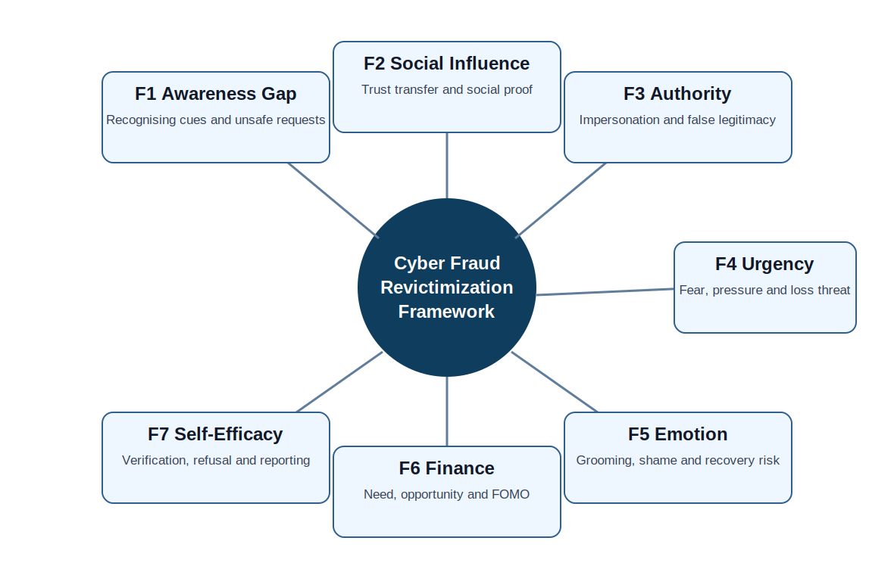

Each factor represents a decision weakness that can appear across different scam types. For example, phishing may begin as an awareness problem, but it may also become a self-efficacy problem if the user does not know how to check the link or report the incident. Investment fraud may begin as a financial opportunity, but may include social proof, urgency and authority cues. The framework is therefore designed to be reusable across scam categories.

## 2.7 Malaysia Public Response and Verification Tools

Malaysia has several public-facing response and verification tools. Semak Mule supports checking account or phone information linked to mule-account concerns. NSRC 997 is a rapid response contact for financial scam cases. Cyber999/MyCERT receives cyber incident reports. The Securities Commission Malaysia provides investment-checking and investor alert resources. Banks also provide hotlines and fraud response processes. These tools show that prevention should not stop at "do not click" advice. Users also need to know the correct sequence of action after suspicion or loss.

The challenge is that public tools may be known separately, but users under pressure may not know which tool fits which situation. A prevention framework must therefore connect scam cues to response channels. This is why official tool mapping is included in the research design.

## 2.8 Research Gap

The reviewed evidence shows several gaps. First, official reports and warnings show the scale and types of fraud, but they are usually not organized into a behavioural revictimization framework. Second, public awareness material often lists scam signs, but does not always translate them into measurable scenario tasks. Third, academic literature explains victimization, phishing mitigation and psychological harm, but local prevention design requires stronger integration with Malaysian reporting and verification tools.

The gap addressed by this research is the lack of a structured, evidence-based framework that links cyber fraud revictimization factors, Malaysian official evidence, behavioural theory, scenario scoring and prevention module design in one report.

## 2.9 Chapter Summary

This chapter reviewed cyber fraud concepts, scam types, related studies, behavioural theories, official response tools and the research gap. The review supports the seven-factor framework and shows that cyber fraud prevention needs measurable practical training. The next chapter explains the methodology used to screen sources, extract evidence, code factors, analyse secondary data and develop the framework.

---

# CHAPTER 3: RESEARCH METHODOLOGY

## 3.1 Introduction

This chapter explains the methodology used to complete the research. The study uses secondary-data analysis and framework development. It does not use invented respondent results. Instead, it uses official reports, public warning sources and academic literature to build a traceable research framework, analyse official indicators and design measurable intervention logic.

## 3.2 Research Design

The research design combines qualitative evidence coding and descriptive secondary-data analysis. Qualitative coding was used to identify factor evidence from official warnings and academic studies. Descriptive analysis was used to examine Cyber999 quarterly incident data and selected scam-category indicators. Framework development was then used to translate the findings into scenario scoring, module mapping and validation logic.

### 3.2.1 Secondary-Data Component

The secondary-data component used official reports and public pages as the main evidence base. The most important numerical dataset came from Cyber999/MyCERT quarterly reports. Other official sources were used to understand public response tools, scam-warning patterns and regulatory guidance. The data were not merged into one national prevalence dataset because the source families measure different things.

### 3.2.2 Framework-Development Component

The framework-development component converted the evidence into seven revictimization factors. Each factor was defined through three checks: theoretical support, official-source support and practical module relevance. A factor was retained only when it helped explain a real scam decision problem and could be translated into scenario tasks or response actions.

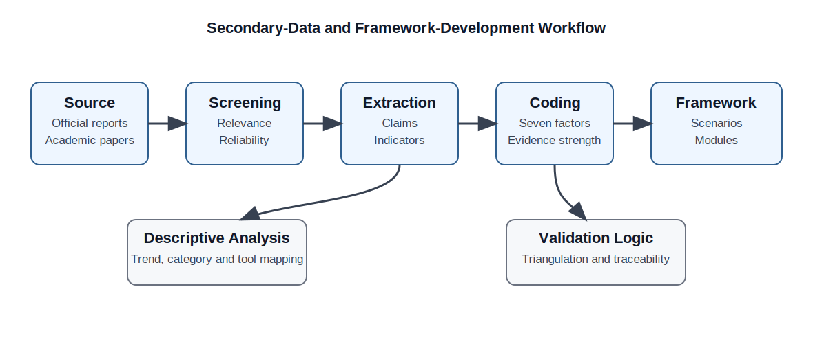

## 3.3 Source Selection

Sources were selected based on relevance, authority, accessibility and usefulness for the framework. Official sources were prioritized for Malaysian incident patterns, warnings and response tools. Academic sources were prioritized for behavioural explanation, victimization predictors, psychosocial impact and mitigation design.

**Table 3.1: Source families used in the research**

| Source family | Examples | Purpose in the research | Treatment in analysis |
|---|---|---|---|
| Cyber incident reports | MyCERT/Cyber999 quarterly reports | Fraud incident trend and category evidence | Used for descriptive trend analysis |
| Enforcement and response sources | PDRM, NSRC, Semak Mule | Scam warnings and reporting pathway evidence | Used for tool and scenario mapping |
| Financial and regulatory sources | BNM, Securities Commission Malaysia | Banking fraud response, investment-scam warnings, verification tools | Used for official response and prevention design |
| Academic papers | Fraud victimization, phishing mitigation, psychosocial impact, behavioural theory | Theory support and factor justification | Used in literature review and framework coding |
| Public proof screenshots | Live official pages captured from accessible sources | Visual evidence of real public tools and warnings | Used as supporting figures |

## 3.4 Inclusion and Exclusion Criteria

The screening criteria were applied to avoid weak or unrelated sources. The research accepts official Malaysian sources, open-access academic papers and public pages that can be traced. It excludes unsupported blog claims, copied statistics without source context, paywalled material that could not be legally accessed, and sources that describe cybercrime in general without relevance to fraud, revictimization or prevention.

**Table 3.2: Inclusion and exclusion criteria**

| Criterion type | Included | Excluded |
|---|---|---|
| Source authority | Official agencies, regulators, peer-reviewed academic sources | Anonymous pages, unsourced statistics, copied social posts |
| Topic relevance | Cyber fraud, scams, victimization, reporting, prevention, phishing, impersonation | General cybersecurity content without fraud relevance |
| Accessibility | Public pages, saved official reports, open-access papers | Pirated files and inaccessible paywalled documents |
| Data compatibility | Clearly defined incident counts, categories or warnings | Mixed values with unclear measurement unit |
| Research use | Supports framework factor, scenario design or official tool mapping | Decorative or repeated material without analytical value |

## 3.5 Data Extraction

Data extraction was carried out at two levels. The first level extracted numerical values such as total incidents, fraud incidents and fraud subcategories from Cyber999 reports. The second level extracted qualitative claims such as scam warning cues, reporting tool functions, psychological harm indicators and behavioural predictors.

**Table 3.3: Cyber999 indicator dataset used for descriptive analysis**

| Period | Total incidents | Fraud incidents | Fraud share (%) | Source |
|---|---:|---:|---:|---|
| 2024 Q2 | 1,481 | 947 | 63.94 | CyberSecurity Malaysia, 2024 Q2 |
| 2024 Q4 | 1,550 | 1,108 | 71.48 | MyCERT, 2024 Q4 |
| 2025 Q1 | 1,657 | 1,126 | 67.95 | MyCERT, 2025 Q1 |
| 2025 Q2 | 2,058 | 1,633 | 79.35 | MyCERT, 2025 Q2 |
| 2025 Q3 | 2,020 | 1,521 | 75.30 | MyCERT, 2025 Q3 |
| 2025 Q4 | 1,881 | 1,471 | 78.20 | MyCERT, 2025 Q4 |

The fraud share was calculated using Equation 3.1.

**Equation 3.1: Fraud incident share**

`Fraud Share (%) = (Fraud Incidents / Total Incidents) x 100`

The dataset is treated as Cyber999 handled-incident evidence. It is not treated as the complete national cyber fraud prevalence rate, because police reports, bank response data and Cyber999 incident handling do not measure the same population.

## 3.6 Evidence Coding Method

Evidence coding was used to connect sources to framework factors. Each relevant source note was reviewed for claims, indicators or guidance related to one or more of the seven factors. The coded evidence was then grouped by factor, source type and report chapter.

**Table 3.4: Evidence coding structure**

| Coding field | Description | Example |
|---|---|---|
| Source ID | Internal traceability code for the source | OFF-10, ACA-01 |
| Source type | Official, academic, dataset, proof screenshot | Official report |
| Evidence claim | The claim extracted from the source | Fraud was the dominant Cyber999 category |
| Factor mapping | Related seven-factor code | F1, F3, F7 |
| Chapter use | Where the claim supports the report | Chapter 2, Chapter 5 |
| Caveat | Boundary of use | Cyber999 handled incidents only |

### 3.6.1 Factor Coding Rules

Each factor was coded only when the evidence clearly supported it. General scam awareness was coded under F1. Social proof, testimonial pressure and trusted contact influence were coded under F2. Official-looking authority, agency impersonation and formal threats were coded under F3. Countdown pressure, legal fear, account-freeze threats and immediate payment requests were coded under F4. Shame, emotional attachment, distress, delayed reporting and recovery scam exposure were coded under F5. Easy-money appeal, income pressure and unrealistic investment return were coded under F6. Verification ability, reporting confidence and refusal skill were coded under F7.

### 3.6.2 Source Reliability Treatment

Official sources were treated as reliable for their own reporting scope. For example, Cyber999 data were accepted as Cyber999 incident-handling records, not as national police case totals. Academic sources were used for conceptual support and behavioural interpretation. Where a source was useful but not directly Malaysia-specific, the report used it only for theory or general victimization behaviour, not for local prevalence claims.

## 3.7 Scenario Scoring Method

Scenario scoring was designed to measure how well a person identifies scam cues and selects safe response actions in a scenario. The scoring is part of the framework design and can be used in training, review or educational evaluation. The score does not claim to represent actual population behaviour. It measures performance within a structured scenario.

**Equation 3.2: Scenario Risk Response Score**

`Scenario Score (%) = (Sum of Correct Weighted Responses / Sum of Maximum Weighted Responses) x 100`

**Table 3.5: Scenario scoring rubric**

| Score area | Weight | Example correct response | Related factor |
|---|---:|---|---|
| Scam cue identification | 25 | Identifies suspicious link, unusual request or fake domain | F1 |
| Pressure recognition | 15 | Recognises urgency, fear or authority manipulation | F3, F4 |
| Independent verification | 25 | Uses official website, hotline, Semak Mule, SC checker or direct bank channel | F7 |
| Refusal and safe action | 20 | Stops payment, refuses personal data sharing, avoids installation | F7 |
| Reporting and evidence preservation | 15 | Keeps screenshots, reports through correct channel and avoids deleting evidence | F5, F7 |

Score interpretation:

| Score range | Interpretation |
|---|---|
| 80-100 | Strong protective response |
| 60-79 | Moderate response with some missing actions |
| 40-59 | Weak response with important risk remaining |
| 0-39 | High-risk response requiring targeted module support |

## 3.8 Module Evaluation Rubric

The module evaluation rubric checks whether each prevention module is aligned with theory, evidence, factor coverage and measurable outcomes. This gives the framework a structured research design instead of only a list of advice.

**Equation 3.3: Module Alignment Index**

`Module Alignment Index (%) = (Matched Criteria / Total Criteria) x 100`

**Table 3.6: Module alignment criteria**

| Criterion | Description | Evidence required |
|---|---|---|
| Factor alignment | Module clearly targets at least one framework factor | Factor code and explanation |
| Evidence support | Module content is supported by official or academic evidence | Source citation |
| Practical activity | Module contains an activity, scenario or decision task | Scenario description |
| Response pathway | Module links to a correct verification or reporting channel | Tool mapping |
| Measurable outcome | Module has an observable score or completion indicator | Rubric or checklist |

## 3.9 Validity and Quality Controls

The study used four quality controls. First, source triangulation was applied by combining official reports, warning pages and academic studies. Second, measurement separation was applied so that different source types were not treated as identical datasets. Third, evidence traceability was maintained through source IDs and the evidence matrix. Fourth, framework checking was applied by mapping every module to factors, theory, evidence and measurable outcomes.

## 3.10 Chapter Summary

This chapter explained the research methodology. The study used secondary-data analysis, evidence coding and framework development. The method allowed the research to produce a complete framework and analysis without inventing respondent-level findings. The next chapter presents the developed framework, module design and practical response model.

---

# CHAPTER 4: RESEARCH DESIGN AND FRAMEWORK DEVELOPMENT

## 4.1 Introduction

This chapter presents the developed framework and module design. The framework converts the literature review and source analysis into a practical prevention structure. The design focuses on what a person needs to recognise, decide, verify, report and recover from in cyber fraud situations.

## 4.2 Seven-Factor Framework Design

The seven-factor framework is the main research output. It was designed to be broad enough to cover different scam categories but specific enough to support scoring and module design.

**Table 4.1: Seven-factor operational definitions**

| Factor | Operational definition | Observable scenario cue | Prevention response |
|---|---|---|---|
| F1 Awareness gap | Difficulty recognising scam indicators or unsafe requests | Suspicious link, fake login page, unusual account request | Cue identification checklist |
| F2 Social influence and trust transfer | Trust created through familiar names, testimonials or group influence | Fake reviews, friends' names, chat-group pressure | Independent verification |
| F3 Authority impersonation | False legitimacy through official identity or formal threat | Agency name, badge, legal warning, official tone | Verify through official channel |
| F4 Urgency and fear | Pressure that reduces time for careful thinking | Countdown, account freeze, arrest threat, immediate payment | Pause and delay response |
| F5 Emotional grooming, shame and recovery | Emotional attachment, embarrassment or recovery vulnerability | Personal bond, shame after loss, recovery offer | Supportive reporting and refusal |
| F6 Financial need and FOMO | Attractive financial opportunity or income pressure | High return, easy task, limited offer | Risk and return testing |
| F7 Protective self-efficacy and reporting | Ability to verify, refuse, report and preserve evidence | Correct use of reporting or checking tools | Tool-based response practice |

The framework is not a technology product. It is a research-based structure that can guide awareness content, educational activities, scenario testing and reporting guidance.

## 4.3 Prevention Module Structure

The framework was translated into five modules. The modules follow the normal flow of a scam encounter: recognition, pressure resistance, verification, reporting and recovery.

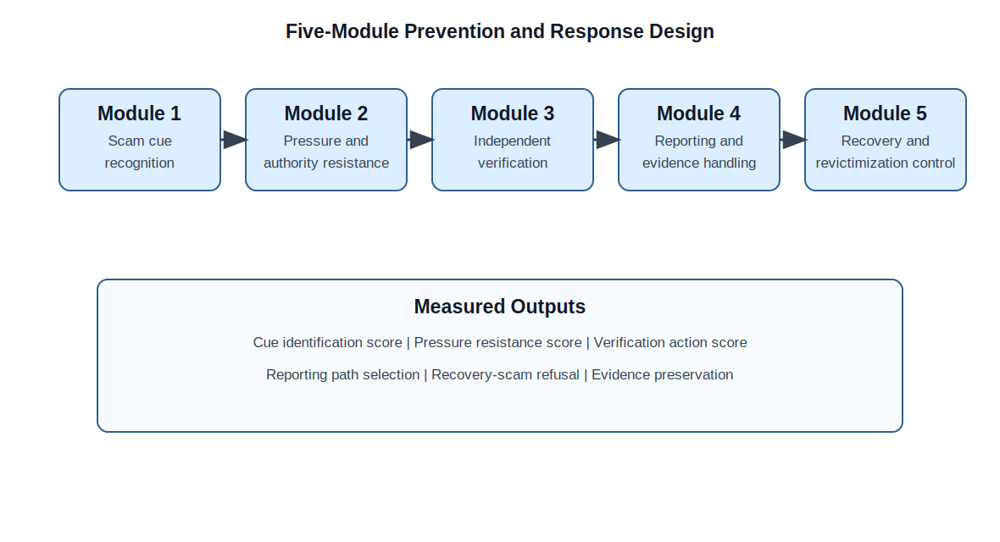

**Table 4.2: Module structure**

| Module | Main purpose | Main factors covered | Output |
|---|---|---|---|
| Module 1: Scam cue recognition | Identify scam indicators before responding | F1 | Cue checklist score |
| Module 2: Pressure and authority resistance | Recognise urgency, fear and false authority | F3, F4 | Pressure recognition score |
| Module 3: Independent verification | Use official channels instead of links provided by the sender | F2, F7 | Verification action score |
| Module 4: Reporting and evidence handling | Select the correct reporting path and preserve useful evidence | F5, F7 | Reporting path score |
| Module 5: Recovery and revictimization control | Reduce shame, prevent recovery scams and encourage safe support | F5, F7 | Recovery refusal score |

### 4.3.1 Module 1: Scam Cue Recognition

This module trains recognition of common scam indicators. The activity uses short messages, payment instructions, links, fake platform examples and social media-style posts. The learner marks the suspicious cue and explains why it is unsafe. The measurable output is the number of correctly identified cues and the number of missed red flags.

### 4.3.2 Module 2: Pressure and Authority Resistance

This module focuses on the point where the scammer tries to reduce careful thinking. The task presents messages with official tone, legal threat, account freeze claims or limited-time instructions. The learner must identify the pressure tactic and choose a safe delay response. This module directly targets authority impersonation and urgency.

### 4.3.3 Module 3: Independent Verification

This module trains the person to verify through a channel not provided by the sender. The task includes account checks, investment checks, bank contact checks and official website checks. This is where Semak Mule, NSRC, Cyber999, SC Investment Checker and bank hotlines become practical tools, not only names in awareness posters.

### 4.3.4 Module 4: Reporting and Evidence Handling

This module trains what to do after suspicion or loss. It covers preserving screenshots, transaction IDs, phone numbers, URLs and chat logs. It also maps the case type to the correct reporting channel. The goal is to reduce confusion during stress and avoid deleting evidence.

### 4.3.5 Module 5: Recovery and Revictimization Control

This module focuses on what happens after the first incident. It addresses shame, self-blame, emotional pressure and recovery-scam offers. The activity trains a safe support statement, refusal of recovery-fee offers and correct reporting action. This module is important because victims may become more vulnerable when they are trying to recover quickly.

## 4.4 Official Tool Integration

Official tools were integrated into the framework as response pathways. The response map does not assume that one tool solves every case. It shows which action belongs to which moment.

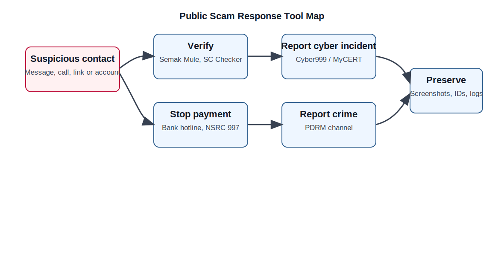

**Table 4.3: Tool integration matrix**

| Situation | Tool/channel | Purpose | Framework factor |
|---|---|---|---|
| Suspicious bank account or phone number | Semak Mule | Check mule-account or phone risk indicator | F7 |
| Ongoing financial scam or recent transfer | NSRC 997 and bank hotline | Rapid response and payment-related action | F7 |
| Cyber incident, phishing or suspicious website | Cyber999/MyCERT | Cyber incident reporting and guidance | F1, F7 |
| Suspicious investment entity | SC Investment Checker and Investor Alert List | Check authorization and warning status | F3, F6, F7 |
| Possible crime report | PDRM channel | Official law enforcement reporting | F7 |

## 4.5 Scenario Design

The scenario design uses short realistic cases rather than generic advice. Each scenario includes a message, a decision point, a pressure element and a safe action. The task can be marked using the scoring rubric from Chapter 3.

**Table 4.4: Scenario design matrix**

| Scenario | Scam pattern | Main cue | Correct action | Factor coverage |
|---|---|---|---|---|
| Bank account freeze message | Phishing and authority impersonation | Link and urgent account threat | Do not click; contact bank through official channel | F1, F3, F4, F7 |
| Investment group promotion | Investment scam | High return, social proof, unrelated account | Check SC resources and reject payment | F2, F6, F7 |
| Job task deposit | Job scam | Easy income and deposit request | Refuse payment and preserve evidence | F6, F7 |
| Agency phone call | Authority impersonation | Legal threat and secrecy instruction | End call and verify independently | F3, F4, F7 |
| Recovery helper message | Recovery scam | Fee required to recover lost money | Reject and report safely | F5, F7 |

## 4.6 Public Proof Figures

The following figures are used as evidence that public-facing warning and response resources exist and can be integrated into the framework. They are not decorative screenshots. Each figure supports the official tool mapping and scenario response design.

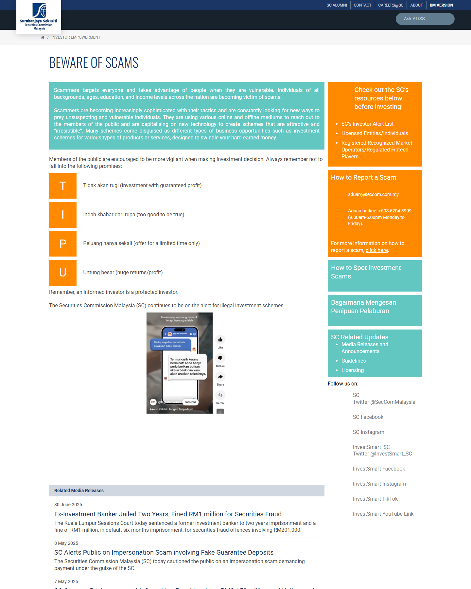

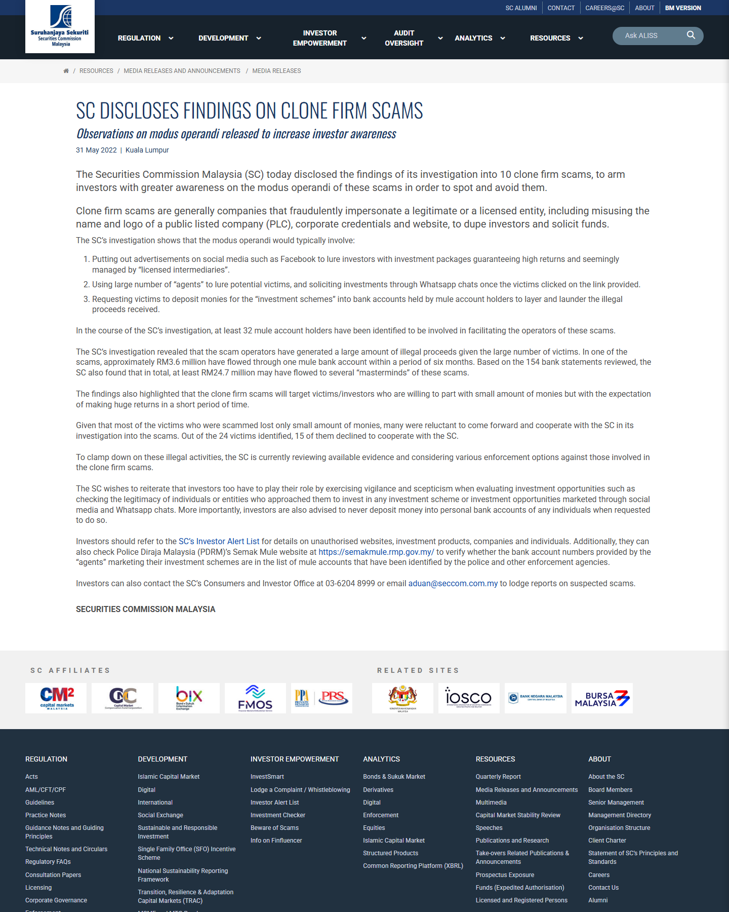

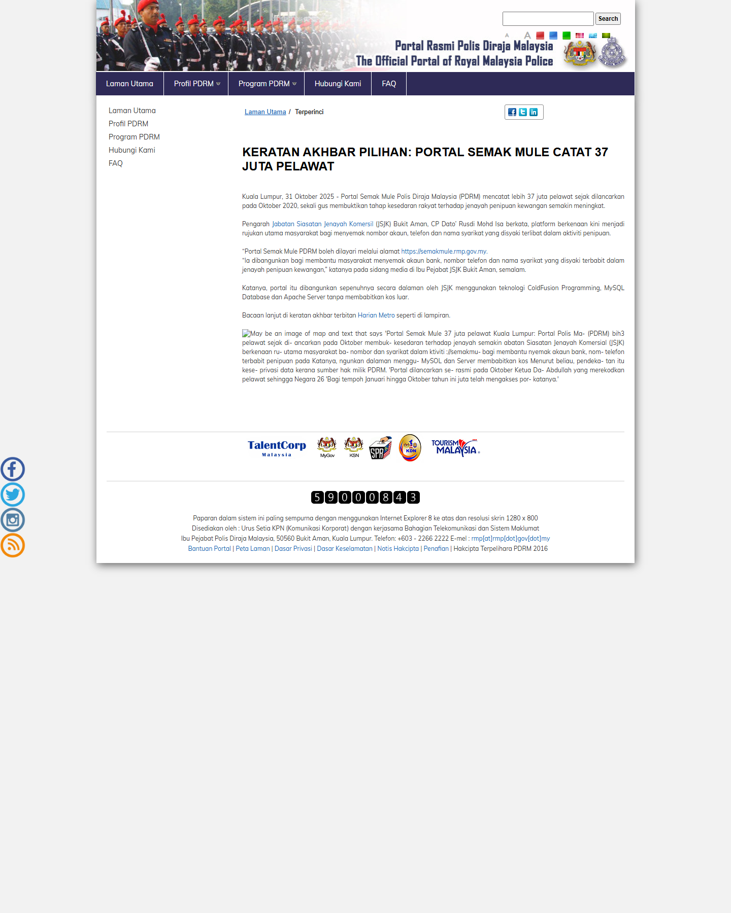

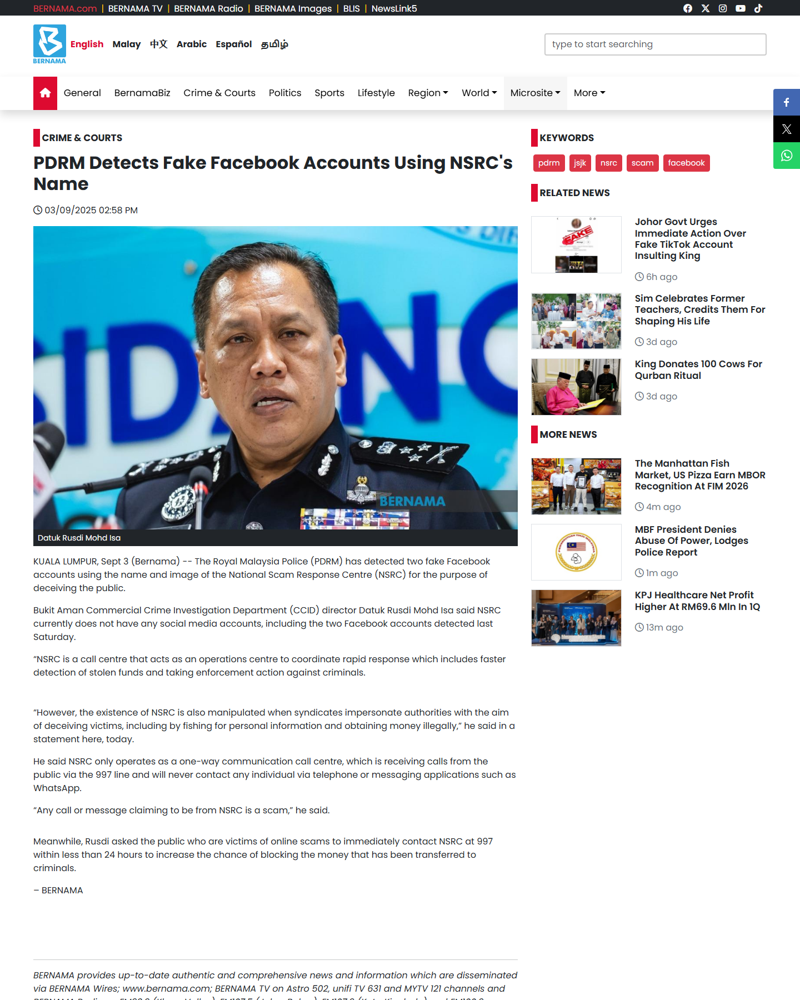

## 4.7 Framework Validation Matrix

The framework was validated through evidence support and design alignment. This is a framework validation approach, not a claim of population-level intervention effectiveness. The matrix checks whether each factor has official evidence, academic support, module coverage and measurable scoring.

**Table 4.5: Framework validation matrix**

| Factor | Official evidence | Academic support | Module coverage | Measurable output |
|---|---|---|---|---|
| F1 Awareness gap | Cyber999 fraud/phishing categories; public warning pages | Phishing mitigation literature | Module 1 | Cue identification score |
| F2 Social influence | Investment and social proof scam warnings | Online fraud victimization predictors | Module 3 | Trust-transfer recognition |
| F3 Authority impersonation | PDRM and regulator impersonation warnings | Behavioural theory support | Module 2 | Authority cue recognition |
| F4 Urgency and fear | Scam-alert pressure warnings | Protection Motivation Theory | Module 2 | Pressure resistance score |
| F5 Emotion and recovery | Recovery scam and reporting-support evidence | Psychosocial harm literature | Module 4, Module 5 | Recovery refusal and reporting score |
| F6 Financial need and FOMO | Job scam and investment scam warnings | Behavioural opportunity framing | Module 3 | Risk-return checking score |
| F7 Protective self-efficacy | NSRC, Semak Mule, Cyber999, SC tools | PMT coping appraisal and self-efficacy | All modules | Verification and reporting score |

## 4.8 Chapter Summary

This chapter presented the developed seven-factor framework, module structure, official tool mapping, scenario design and framework validation matrix. The design converts evidence into practical, measurable prevention work. The next chapter presents the results, analysis and discussion.

---

# CHAPTER 5: RESULTS, ANALYSIS AND DISCUSSION

## 5.1 Introduction

This chapter presents the results of the secondary-data analysis and framework validation. The analysis uses Cyber999 quarterly indicators, fraud subcategory values, evidence coverage coding, response-tool mapping and research-question discussion. The chapter reports what the evidence supports and keeps the interpretation within the correct source boundaries.

## 5.2 Cyber999 Fraud Incident Trend

The Cyber999 trend shows that fraud remained a dominant handled-incident category across the analysed quarters. Fraud incidents increased from 947 in 2024 Q2 to 1,633 in 2025 Q2. The fraud share remained above 67 percent in each analysed quarter and reached 79.35 percent in 2025 Q2. In 2025 Q4, fraud accounted for 1,471 of 1,881 handled incidents, equal to 78.20 percent.

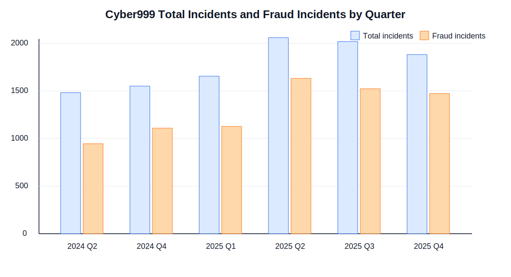

**Table 5.1: Cyber999 fraud trend analysis**

| Period | Total incidents | Fraud incidents | Fraud share (%) | Interpretation |
|---|---:|---:|---:|---|
| 2024 Q2 | 1,481 | 947 | 63.94 | Fraud was already a majority category |
| 2024 Q4 | 1,550 | 1,108 | 71.48 | Fraud share increased |
| 2025 Q1 | 1,657 | 1,126 | 67.95 | Fraud remained dominant |
| 2025 Q2 | 2,058 | 1,633 | 79.35 | Highest analysed fraud share |
| 2025 Q3 | 2,020 | 1,521 | 75.30 | Fraud remained high despite a lower total than Q2 |
| 2025 Q4 | 1,881 | 1,471 | 78.20 | Fraud remained the leading handled-incident pattern |

The trend supports the research problem because fraud is not a rare or marginal category in the analysed Cyber999 reports. The values also support the decision to focus on public-facing fraud prevention rather than only technical incident response.

## 5.3 Fraud Category Analysis

The Q2 2025 Cyber999 report provides useful subcategory detail. Phishing was the largest listed fraud subcategory, followed by impersonation or spoofing. Job scam, bogus email and fraudulent website categories were smaller but still relevant because they represent different decision problems.

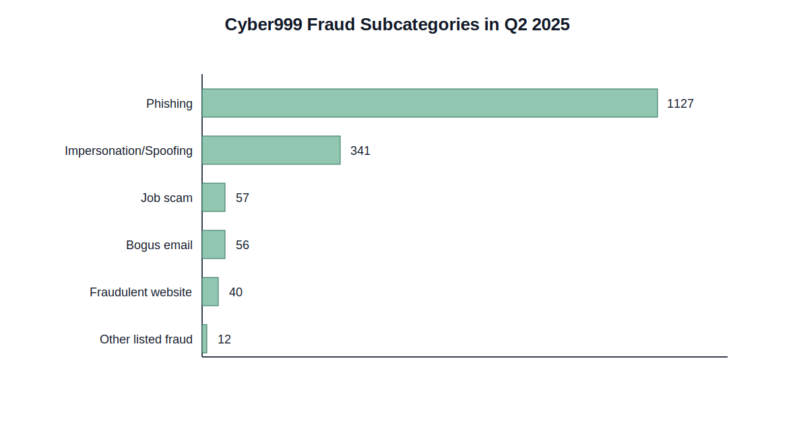

**Table 5.2: Q2 2025 fraud subcategory interpretation**

| Fraud subcategory | Count | Research interpretation | Related factor |
|---|---:|---|---|
| Phishing | 1,127 | Link and credential-risk training is essential | F1, F7 |
| Impersonation/spoofing | 341 | False identity and authority cues remain important | F3, F4 |
| Job scam | 57 | Financial need and easy-income promises need scenario coverage | F6 |
| Bogus email | 56 | Email trust and sender verification remain relevant | F1, F7 |
| Fraudulent website | 40 | Website checking and domain suspicion need practice | F1, F7 |
| Other listed fraud | 12 | Smaller categories still support broad factor design | Mixed |

The category result supports a factor-based approach. Phishing and impersonation are visible in the data, but job scams and fraudulent websites show that the framework should not focus on only one scam type. A prevention module must support transfer across categories.

## 5.4 Evidence Coverage Result

Evidence coverage was analysed by counting how many official and academic sources supported each factor. The result shows that F1 awareness gap and F7 protective self-efficacy had strong support from both official and academic evidence. F3 authority impersonation and F4 urgency had strong official support because public warnings often describe impersonation and pressure tactics. F5 emotional grooming and recovery vulnerability had stronger academic support because psychosocial impact is more often discussed in academic studies.

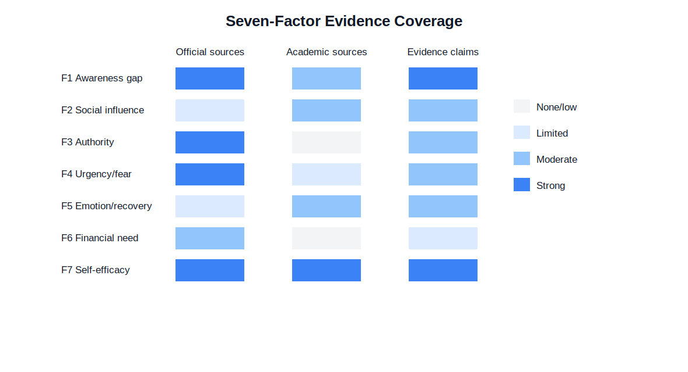

**Table 5.3: Evidence coverage by factor**

| Factor | Official support | Academic support | Evidence interpretation |
|---|---|---|---|
| F1 Awareness gap | Strong | Moderate | Strong foundation for cue-recognition activities |
| F2 Social influence and trust transfer | Limited | Moderate | Needs scenario design for social proof and testimonial pressure |
| F3 Authority impersonation | Strong | Low | Strong official warning support; theory explains compliance |
| F4 Urgency and fear | Strong | Limited | Strong public warning support; PMT supports threat appraisal |
| F5 Emotional grooming, shame and recovery | Limited | Moderate | Academic literature supports recovery and harm dimension |
| F6 Financial need and FOMO | Moderate | Low | Official scam warnings support financial-opportunity framing |
| F7 Protective self-efficacy and reporting | Strong | Strong | Strongest factor for practical prevention design |

The coverage result does not remove weaker factors. Instead, it shows why a mixed evidence base is needed. Some factors are visible in official reports, while others are better explained through academic victim-impact literature.

## 5.5 Response Tool Mapping Result

The tool mapping analysis shows that Malaysia has several public response and verification resources, but each tool has a different role. A suspicious investment should be checked differently from a recent bank transfer scam. A phishing website report is different from a mule-account check. The framework therefore maps the tools by situation rather than listing them generally.

**Table 5.4: Response-tool mapping result**

| Tool/channel | Main function in framework | Best linked module |
|---|---|---|
| Semak Mule | Checking suspicious bank account or phone information | Module 3 |
| NSRC 997 | Rapid response for financial scam cases | Module 4 |
| Cyber999/MyCERT | Cyber incident reporting and support | Module 4 |
| SC Investment Checker and Investor Alert List | Investment entity verification | Module 3 |
| Bank hotline | Account and transaction response | Module 4 |
| PDRM reporting channel | Crime reporting and investigation pathway | Module 4 |

This result supports the practical side of the research. A person cannot be expected to report correctly if the training only says "report the scam" without showing which channel fits which problem.

## 5.6 Framework Validation Result

The framework validation result is based on module alignment, factor coverage and evidence traceability. All seven factors are covered by at least one module and each module has a measurable outcome. The framework also includes official tool integration, which strengthens practical relevance.

**Table 5.5: Objective achievement and validation result**

| Objective | Result achieved | Evidence in report |
|---|---|---|
| Analyse official and academic evidence | Completed through source screening, related studies and secondary-data tables | Chapter 2, Chapter 3, Chapter 5 |
| Identify revictimization factors | Seven factors defined and operationalized | Table 4.1 |
| Develop evidence-based framework | Framework built from theory, official sources and academic literature | Figure 2.1, Table 4.5 |
| Design scenario scoring and modules | Scenario score, module structure and rubric developed | Table 3.5, Table 4.2, Table 4.4 |
| Evaluate framework using secondary analysis | Trend, category, evidence coverage and response-tool analysis completed | Figures 5.1-5.4, Tables 5.1-5.5 |

The validation result shows that the research output is complete as a secondary-data and framework-development study. It does not claim to measure real participant improvement. Its contribution is the evidence-backed framework, scoring method and prevention design.

## 5.7 Discussion by Research Question

### 5.7.1 RQ1: Factors Associated with Revictimization Risk

The evidence supports seven main factors: awareness gap, social influence, authority impersonation, urgency, emotional grooming, financial pressure and protective self-efficacy. These factors explain why a person may respond unsafely even after knowing that scams exist. The strongest practical factor is F7 because protective self-efficacy turns awareness into action.

### 5.7.2 RQ2: Organizing Official and Academic Evidence

The study organized official sources and academic literature using source families, inclusion criteria and factor coding. Official sources were strongest for incident patterns, scam warnings and response tools. Academic sources were strongest for victimization predictors, psychological impact and behaviour theory. This separation improved the research quality because each source was used for what it can actually support.

### 5.7.3 RQ3: Translating Factors into Measurable Tasks

The factors were translated into scenario scoring and five prevention modules. Each module has a target factor, activity and measurable output. This makes the framework more research-based than a general awareness checklist.

### 5.7.4 RQ4: Patterns from Secondary Data and Evidence Coding

The Cyber999 trend shows that fraud was consistently a dominant handled-incident category in the analysed reports. Q2 2025 had the highest fraud share in the analysed period. The fraud subcategory analysis shows that phishing and impersonation/spoofing were especially important. Evidence coding showed that some factors are strongly supported by official data, while others require academic literature for explanation.

### 5.7.5 RQ5: Addressing the Awareness-to-Action Gap

The framework addresses the awareness-to-action gap by connecting warning signs to action. It does not stop at telling people to be careful. It requires cue recognition, pressure resistance, independent verification, reporting and recovery-scam refusal. This is the main reason the framework is suitable for practical prevention design.

## 5.8 Chapter Summary

This chapter presented the completed secondary-data results and framework analysis. The findings show that fraud remained a major Cyber999 handled-incident category, phishing and impersonation were important subcategories, and the seven-factor framework is supported by a combination of official and academic evidence. The next chapter concludes the research and presents recommendations.

---

# CHAPTER 6: CONCLUSION AND RECOMMENDATIONS

## 6.1 Introduction

This chapter concludes the research. It summarizes the main findings, objective achievement, research contribution, limitations and recommendations. The conclusion keeps the study within its actual design as a secondary-data and framework-development study.

## 6.2 Summary of Research Findings

The research found that cyber fraud revictimization should be understood as a combination of awareness, social influence, authority pressure, urgency, emotional vulnerability, financial pressure and protective self-efficacy. Official Malaysian sources show repeated fraud patterns and public response channels. Academic literature explains why knowledge alone may not produce safe behaviour. The seven-factor framework connects these two evidence types.

The Cyber999 analysis showed that fraud remained a dominant handled-incident category across the analysed quarters. The category analysis showed that phishing and impersonation/spoofing were major patterns, while job scams, bogus email and fraudulent websites supported broader scenario coverage. The evidence coverage analysis showed that F1 and F7 had strong support, while F5 required academic victim-impact literature to explain recovery vulnerability and delayed reporting.

## 6.3 Achievement of Research Objectives

All five research objectives were achieved within the secondary-data and framework-development design.

**Table 6.1: Research objective achievement**

| Objective | Achievement |
|---|---|
| Objective 1 | Official and academic evidence was analysed through source screening, extraction and coding |
| Objective 2 | Seven revictimization factors were identified and defined |
| Objective 3 | A seven-factor framework was developed using theory, official evidence and literature |
| Objective 4 | Scenario scoring, prevention modules and official tool mapping were designed |
| Objective 5 | The framework was evaluated using secondary-data trends, category analysis, evidence coverage and validation mapping |

## 6.4 Research Contribution

The first contribution is a structured seven-factor framework for cyber fraud revictimization. The framework separates scam labels from underlying decision factors. This is useful because different scam categories can use the same psychological and practical pressure points.

The second contribution is a measurable scenario scoring method. The scoring method gives prevention work a way to evaluate cue recognition, pressure recognition, verification, refusal, reporting and evidence preservation. This makes the framework more actionable than a general awareness message.

The third contribution is an official tool response map. The research connects Semak Mule, NSRC, Cyber999, Securities Commission resources, banks and PDRM channels to specific scam situations. This supports practical public response.

The fourth contribution is the separation of evidence types. The report does not mix Cyber999 incident-handling figures, police case totals, regulator warnings and banking-sector response figures as if they are one dataset. This improves research clarity and reduces misleading interpretation.

## 6.5 Research Limitations

The research uses official secondary data and literature-based framework validation. It does not claim respondent-level prevalence, individual victim behaviour measurement or live module effectiveness. The Cyber999 dataset represents incidents handled by Cyber999, not all fraud cases in Malaysia. PDRM, BNM, SC and Cyber999 sources measure different parts of the cyber fraud environment, so the analysis keeps them separate.

Some factors, such as emotional grooming and recovery vulnerability, have stronger academic support than local official numerical support. This is expected because official reporting sources usually record incident categories, while emotional harm is more often discussed in victimization literature. The limitation does not weaken the framework, but it defines the boundary of the evidence.

## 6.6 Recommendations

Public cyber fraud education should move beyond repeated warning lists and include measurable scenario practice. Users should be trained to identify scam cues, recognise pressure, verify independently, report correctly and recover safely after exposure. Awareness content should also include recovery-scam refusal and shame-reduction messages because delayed reporting can increase harm.

Organizations that deliver cyber safety education can adapt the seven-factor framework into short training sessions, public awareness material, university safety workshops or community modules. Each module should include at least one scenario, one verification activity and one reporting pathway. Evaluation should use scoring rubrics so that the outcome is observable.

Official public resources should continue to be presented in a clearer action sequence. A person under pressure needs to know what to do first, what to check, what evidence to keep and which channel to contact. The response tool map developed in this research can support that sequence.

## 6.7 Conclusion

This research developed a complete secondary-data and framework-development study on cyber fraud revictimization in Malaysia. It used official reports, public warning resources, open-access academic literature, evidence coding and descriptive analysis to build a seven-factor prevention framework. The study showed that cyber fraud prevention needs more than general awareness. It needs practical decision support, scenario testing, verification confidence, reporting ability and recovery protection. The final framework provides a structured basis for cyber fraud prevention work that is realistic, evidence-backed and suitable for further adaptation in public education settings.

---

# REFERENCES

Ajzen, I. (1991). The theory of planned behavior. Organizational Behavior and Human Decision Processes, 50(2), 179-211.

Balakrishnan, V., Ng, K. S., & Rahim, H. A. (2025). Predictors of online fraud victimization in Malaysia: The role of overconfidence, social influence and protective behaviour. PLOS ONE.

Bai, Z., Ho, R., Sung, C., Hung, K., & Tsai, J. (2026). Mental health and psychosocial sequelae of fraud victimization: A systematic review. Frontiers in Psychology.

Balcombe, L. (2025). The mental health impacts of internet scams. International Journal of Environmental Research and Public Health.

Bank Negara Malaysia. (2025). Fraud prevention and response materials. Bank Negara Malaysia.

CyberSecurity Malaysia. (2024). Cyber999 incident report: Quarter 2 2024. CyberSecurity Malaysia.

MyCERT. (2024). Cyber incident summary report: Quarter 4 2024. CyberSecurity Malaysia.

MyCERT. (2025a). Cyber incident summary report: Quarter 1 2025. CyberSecurity Malaysia.

MyCERT. (2025b). Cyber incident summary report: Quarter 2 2025. CyberSecurity Malaysia.

MyCERT. (2025c). Cyber incident summary report: Quarter 3 2025. CyberSecurity Malaysia.

MyCERT. (2025d). Cyber incident summary report: Quarter 4 2025. CyberSecurity Malaysia.

Naqvi, B., Perova, K., Farooq, A., Makhdoom, I., Oyedeji, S., & Porras, J. (2023). Mitigation strategies against the phishing attacks: A systematic literature review. Computers & Security.

National Scam Response Centre. (n.d.). NSRC 997 public scam response information.

Polis Diraja Malaysia. (n.d.). Scam Alert and Semak Mule public resources.

Rogers, R. W. (1975). A protection motivation theory of fear appeals and attitude change. Journal of Psychology, 91(1), 93-114.

Securities Commission Malaysia. (n.d.-a). Beware of scams and investment scam warning signs.

Securities Commission Malaysia. (n.d.-b). Investment Checker and Investor Alert List.

Whitty, M. T. (2025). A systematic literature review of cyber scam victim profiling. Cogent Social Sciences.

---

# APPENDICES

## Appendix A: Source Traceability Table

| Source ID | Source name | Type | Main use in report |
|---|---|---|---|
| OFF-05 | PDRM Scam Alert | Official public warning | Scam techniques and reporting context |
| OFF-06 | Semak Mule | Official checking tool | Tool mapping and verification module |
| OFF-07 | NSRC 997 | Official response tool | Financial scam response pathway |
| OFF-08 | MyCERT Q4 2024 report | Official incident report | Cyber999 trend analysis |
| OFF-09 | MyCERT Q1 2025 report | Official incident report | Cyber999 trend analysis |
| OFF-10 | MyCERT Q2 2025 report | Official incident report | Trend and category analysis |
| OFF-11 | MyCERT Q3 2025 report | Official incident report | Trend analysis |
| OFF-12 | MyCERT Q4 2025 report | Official incident report | Trend analysis |
| OFF-13 | SC Beware of Scams | Official regulator guidance | Investment scam cues |
| OFF-14 | SC Investment Checker | Official checking tool | Verification module |
| OFF-15 | SC Investor Alert List | Official warning list | Investment scam prevention |
| OFF-18 | CyberSecurity Malaysia Q2 2024 report | Official incident report | Trend baseline |
| ACA-01 | Balakrishnan et al. | Academic paper | Behavioural predictors |
| ACA-03 | Whitty | Academic review record | Victim profiling |
| ACA-04 | Bai et al. | Academic systematic review | Psychosocial impact |
| ACA-08 | Balcombe | Academic article | Mental health impact |
| ACA-10 | Naqvi et al. | Academic systematic review | Phishing mitigation |

## Appendix B: Construct and Variable Table

| Construct | Variable code | Example item or observation | Source support |
|---|---|---|---|
| Awareness gap | F1_CUE | Identifies suspicious URL, fake login page or unsafe instruction | Cyber999, phishing literature |
| Social influence | F2_SOC | Recognises fake testimonials, group pressure or trusted-name misuse | Balakrishnan et al.; SC warnings |
| Authority impersonation | F3_AUTH | Identifies false agency or official threat | PDRM, SC, BNM warnings |
| Urgency and fear | F4_URG | Recognises deadline, legal threat or account-freeze pressure | PDRM warnings; PMT |
| Emotional vulnerability | F5_EMO | Identifies shame, grooming or recovery-scam pressure | Bai et al.; Balcombe |
| Financial pressure | F6_FIN | Identifies unrealistic return or easy-income promise | SC and PDRM warning materials |
| Protective self-efficacy | F7_SELF | Selects correct verification and reporting action | NSRC, Semak Mule, Cyber999, SC tools |

## Appendix C: Scenario Task Template

| Scenario field | Description |
|---|---|
| Scenario title | Short scam situation, such as bank freeze message or investment group offer |
| Message content | The suspicious message, call summary or website prompt |
| Hidden risk cue | Link, payment request, urgency, authority, social proof or recovery offer |
| Required response | Pause, verify, refuse, report or preserve evidence |
| Score allocation | Cue identification, pressure recognition, verification, refusal and reporting |

## Appendix D: Module Checklist

| Module | Required checklist item |
|---|---|
| Module 1 | At least three scam cues and one safe explanation task |
| Module 2 | At least two pressure tactics and one delay-response activity |
| Module 3 | At least two official verification tools and one independent-check task |
| Module 4 | At least one reporting path and evidence preservation checklist |
| Module 5 | At least one recovery-scam refusal and one supportive reporting message |

## Appendix E: Secondary Analysis Notes

The Cyber999 trend table was calculated from official quarterly reports and kept separate from police case totals and bank-sector response indicators. Fraud share was calculated using Equation 3.1. Q2 2025 fraud subcategory values were extracted from the Cyber999 report and used to support the category analysis. Evidence coverage was coded from source notes and grouped by the seven-factor framework. The analysis supports the framework as a secondary-data and evidence-backed design study.
