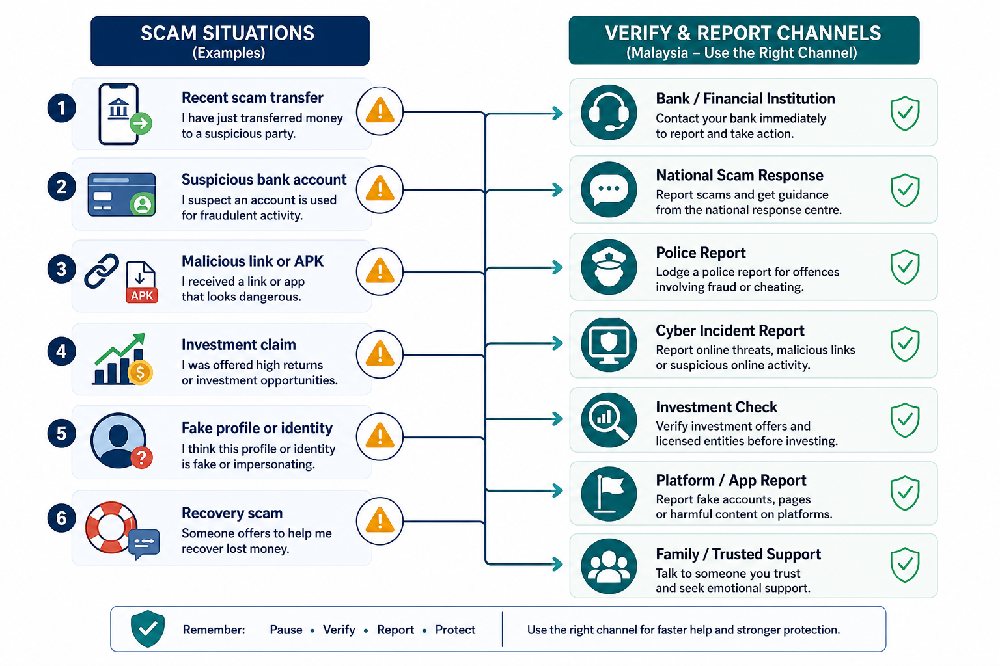

# Study on Identification of Factors and Development of Modules for Methods to Prevent Cyber Fraud Revictimization Problems Among Public in Malaysia

## Abstract

Cyber fraud remains a serious public safety and cybersecurity concern because many scams are no longer based only on technical compromise. They often depend on persuasion, trust, authority, urgency, emotional pressure, financial need, and weak verification habits. In Malaysia, official and regulatory sources show continuing fraud-related reports, active scam response infrastructure, and locally adapted scam methods involving phishing, smishing, impersonation, malicious APKs, investment schemes, job scams, love scams, mule accounts, and recovery-style deception. However, general cyber fraud awareness does not fully explain why some individuals remain vulnerable after earlier exposure or victimization.

This study focuses on cyber fraud revictimization among the public in Malaysia. It integrates the Theory of Planned Behavior, Protection Motivation Theory, and Cognitive Appraisal Theory to identify behavioural and psychosocial factors that may influence repeated scam vulnerability. A seven-factor taxonomy is proposed: overconfidence and awareness-behaviour gap; social influence, trust transfer, and social proof; authority impersonation and institutional compliance; urgency, fear, and high-arousal compliance; emotional grooming, shame, and post-victim recovery vulnerability; financial need, opportunity pressure, and reward/FOMO bias; and protective self-efficacy, verification friction, and recovery/reporting capability. These factors guide the questionnaire, scenario-based assessment, intervention module design, and evaluation framework.

The proposed research uses a quantitative survey supported by scenario-based assessment and pre-test/post-test module evaluation. The study separates prior victims, repeat victims, attempted-scam exposed non-victims, and respondents with no known exposure. This distinction is necessary because revictimization cannot be assumed from general scam prevalence. The study also proposes five intervention modules that focus on scam awareness, cue detection, threat and coping appraisal, verification and reporting routines, and recovery support. Since no survey or intervention dataset is currently available, the results chapter is prepared as a data-honest analysis structure and does not report unsupported findings.

**Keywords:** cyber fraud, revictimization, scam prevention, Malaysia, Theory of Planned Behavior, Protection Motivation Theory, Cognitive Appraisal Theory, verification behaviour.

## Table of Contents

1. Chapter 1: Introduction  
2. Chapter 2: Literature Review  
3. Chapter 3: Research Methodology  
4. Chapter 4: Research Design and Intervention Module  
5. Chapter 5: Results, Analysis and Discussion  
6. Chapter 6: Conclusion and Future Work  
7. References  

# CHAPTER 1: INTRODUCTION

## 1.1 Introduction

Cyber fraud has become a major digital safety issue because everyday financial, social, educational, commercial, and public-service activities now depend on online banking, e-wallets, e-commerce, mobile applications, social media, and messaging platforms. These services create convenience, but they also create repeated contact points through which scammers can approach the public. Malaysian users may encounter phishing links, smishing messages, fake government-aid pages, malicious Android Package Kit (APK) files, fake investment schemes, job-task scams, e-commerce fraud, love scams, and impersonation calls using the names of agencies such as PDRM, BNM, LHDN, MCMC, Securities Commission Malaysia, NSRC, banks, courts, and delivery companies.

Cyber fraud in this study refers to deception conducted through digital or communication technologies to obtain money, credentials, personal information, system access, or other unlawful advantage. The term covers both technical and social-engineering forms of fraud. Technical compromise may involve malicious APKs, phishing websites, credential theft, account takeover, or malware. However, many incidents begin with human persuasion: a user clicks a link, installs an application, trusts a fake authority, shares an OTP/TAC, transfers money, or continues communication with a fraudulent person. Therefore, this study treats cyber fraud as both a cybersecurity issue and a behavioural decision-making problem.

The focus of this research is cyber fraud revictimization among the public in Malaysia. A prior victim is an individual who has previously experienced confirmed cyber fraud victimization, such as financial loss, credential compromise, unauthorized use of personal information, malicious installation, or a reported scam incident. Repeat victimization refers to a later scam incident after an earlier victimization experience. Revictimization tendency refers to measurable vulnerability after prior scam exposure, including repeated risky compliance, repeated scam exposure with unsafe responses, susceptibility to recovery scams, delayed reporting caused by shame or confusion, and low confidence in using protective channels.

## 1.2 Problem Background

Malaysia has developed several institutional responses to cyber fraud. These include the National Scam Response Centre (NSRC), Semak Mule, Cyber999/MyCERT reporting, Bank Negara Malaysia anti-fraud measures, the National Fraud Portal, Securities Commission Malaysia investor-protection tools, MCMC cooperation, public scam-awareness campaigns, and police reporting channels. Bank Negara Malaysia reported that the National Fraud Portal was launched in September 2024 to support faster identification of suspected fraud transactions and mule accounts. The Ministry of Finance reported that the NSRC had received 122,603 calls from its launch in October 2022 to August 2024. CyberSecurity Malaysia reported that fraud was the dominant Cyber999 incident category in Q4 2024 and Q1 2025.

These tools are important, but they do not remove the behavioural gap. A user who is frightened by a fake authority call may still transfer money. A user who sees a limited-time investment opportunity may skip verification. A prior victim may avoid reporting because of shame or may trust a fake recovery service that claims it can recover lost funds. A digitally experienced user may still click a convincing link if overconfidence makes verification feel unnecessary. The central problem is therefore not only whether the public has heard about scams, but whether people can act safely when fraudsters use urgency, authority, social proof, emotional grooming, and financial pressure.

Current Malaysian evidence supports this behavioural focus. Balakrishnan, Ahhmed and Basheer (2025) found that overconfidence and social influence significantly predicted online fraud victimization among Malaysian adults. Securities Commission Malaysia has warned that investment scams often use high-return promises, limited-time framing, fake testimonials, social media promotion, celebrity or personality misuse, clone entities, and payments to personal or unrelated accounts. CyberSecurity Malaysia has documented local phishing, smishing, vishing, malicious APK, impersonation, government-aid, delivery, traffic-summons, and bank/e-wallet themes. These patterns show that scam cues are local, familiar, and psychologically targeted.

However, direct research on cyber fraud revictimization in Malaysia remains limited. Existing evidence supports the study of fraud victimization, scam infrastructure, reporting systems, and behavioural susceptibility, but it does not fully explain how prior victims become vulnerable again. This creates the research gap. Revictimization must be measured directly instead of assumed from general scam prevalence. The study must distinguish prior victims, repeat victims, attempted-scam targets, and respondents with no known exposure. It must also examine whether the public can use protective tools under realistic scam pressure, not merely whether the tools are known by name.

## 1.3 Research Aim

The aim of this research is to identify psychosocial factors that contribute to cyber fraud revictimization among the public in Malaysia and to develop theory-based intervention modules that strengthen protective behaviour, verification capability, reporting confidence, and resistance to repeated victimization.

## 1.4 Research Questions

The research questions are:

1. What psychosocial factors contribute to cyber fraud revictimization tendency among the public in Malaysia, based on the Theory of Planned Behavior, Protection Motivation Theory, and Cognitive Appraisal Theory?
2. How do the seven revictimization factor categories relate to protective intention, protective behaviour, scenario-based risky compliance, reporting behaviour, and recovery-scam resistance?
3. How can theory-based intervention modules be designed to address local scam cues, prior-victim vulnerability, verification friction, shame, and repeated targeting?
4. How can the proposed intervention modules be evaluated for improvement in scam cue detection, protective self-efficacy, response efficacy, safe scenario response, reporting intention, and revictimization resistance?

## 1.5 Research Objectives

The objectives of this research are:

1. To identify and operationalise psychosocial factors that contribute to cyber fraud revictimization among the public in Malaysia using the Theory of Planned Behavior, Protection Motivation Theory, Cognitive Appraisal Theory, and the seven-factor revictimization taxonomy.
2. To develop theory-based intervention modules that address overconfidence, social influence, authority impersonation, urgency, emotional grooming, financial pressure, verification friction, reporting capability, and post-victim recovery vulnerability.
3. To prepare an evaluation framework for the intervention modules using pre-test and post-test measures of scam detection, protective intention, self-efficacy, response efficacy, scenario-based safe response, reporting capability, and recovery-scam resistance.

## 1.6 Research Scope

This study focuses on cyber fraud affecting the public in Malaysia, particularly scams involving social engineering, impersonation, phishing, smishing, malicious APKs, investment schemes, e-commerce fraud, job scams, love scams, recovery scams, non-existent loan scams, and mule-account-related payment deception. The target respondents are Malaysian internet users who use digital communication, social media, e-commerce, mobile banking, e-wallets, or related online services.

The study focuses on behavioural and psychosocial factors rather than malware reverse engineering, forensic investigation, syndicate profiling, or banking-system design. The theoretical scope is limited to the Theory of Planned Behavior, Protection Motivation Theory, and Cognitive Appraisal Theory, supported by the seven-factor taxonomy developed for this study. Official, regulatory, and academic sources are used as the main evidence base. News and vendor threat-intelligence sources are treated only as supporting context where they provide case details or technical examples.

## 1.7 Research Contribution

This research contributes academically by developing a Malaysia-specific behavioural framework for cyber fraud revictimization. Instead of treating cyber fraud only as a technical security issue or a general awareness problem, the study connects repeated vulnerability to intention, social influence, threat appraisal, coping appraisal, real-time cognitive interpretation, emotional recovery, and practical verification capability.

The study also contributes methodologically by operationalising revictimization as measurable behaviour and history. It separates prior victimization, repeat victimization, attempted-scam exposure, scenario-based risky compliance, delayed reporting, recovery-scam vulnerability, and tool-use capability. This distinction is necessary because a person may be aware of scams but still fail to perform safe actions under pressure.

Practically, the research supports the development of intervention modules that can be adapted for public education, universities, community programmes, banks, regulators, cybersecurity awareness teams, and victim-support initiatives. The modules are designed around local scam cues and protective tools such as NSRC 997, bank hotlines, Semak Mule, Cyber999/MyCERT, PDRM reporting, and Securities Commission Malaysia investor-checking resources.

## 1.8 Report Organization

This report is organized into six chapters. Chapter 1 introduces the research background, problem, aim, questions, objectives, scope, contribution, and report structure. Chapter 2 reviews literature and evidence on cyber fraud, revictimization, behavioural factors, institutional responses, and theoretical foundations. Chapter 3 explains the methodology, including respondent groups, sampling strategy, questionnaire constructs, scenario design, data collection, ethics, and analysis methods. Chapter 4 presents the research design and intervention module framework. Chapter 5 presents the results, analysis, and discussion structure without inventing findings before data collection. Chapter 6 concludes the report and suggests future work.

# CHAPTER 2: LITERATURE REVIEW

## 2.1 Introduction

This chapter reviews the literature and evidence needed to support a study of cyber fraud revictimization among the public in Malaysia. The review begins with the local cyber fraud environment, then discusses scam types, techniques, behavioural theories, revictimization factors, and existing prevention approaches. The main concern is the difference between general cyber fraud awareness and revictimization prevention because the study aims to measure repeated vulnerability after prior exposure or victimization.

The review is built on three foundations. First, official and regulatory sources are used to understand the Malaysian scam environment and the available response tools. Second, academic sources are used to justify behavioural constructs such as overconfidence, social influence, self-efficacy, appraisal, and protective intention. Third, the seven-factor revictimization taxonomy is used to translate the literature into measurable constructs and intervention targets.

## 2.2 Malaysian Cyber Fraud Context

Cyber fraud continues to affect Malaysians despite stronger banking safeguards, reporting mechanisms, law-enforcement response, platform takedown activities, and public awareness campaigns. Bank Negara Malaysia's annual reporting and public releases describe anti-fraud initiatives such as the National Fraud Portal and stronger mule-account identification. The Ministry of Finance reported heavy use of the NSRC and blocked suspicious transactions through coordinated response activity. CyberSecurity Malaysia's Cyber999 quarterly summaries show that fraud remained the largest reported incident category in Q4 2024 and Q1 2025.

These figures should not be merged into a single national trend table because they measure different things. Cyber999 reports are incidents handled by CyberSecurity Malaysia. NSRC figures reflect scam-reporting and advisory calls. BNM indicators reflect banking-sector fraud response. Semak Mule evidence reflects public verification infrastructure. Securities Commission Malaysia evidence reflects capital-market and investment-scam enforcement. For this reason, the evidence is treated as separate indicators rather than forced into one combined statistic.

| Evidence area | Verified indicator used in this study | Research value | Caveat |
| --- | --- | --- | --- |
| Banking response | National Fraud Portal and mule-account identification initiatives | Supports the importance of rapid reporting and response capability | Banking response evidence does not directly measure victim psychology |
| NSRC response | 122,603 calls from launch to August 2024 | Supports the need for reporting-speed and recovery-capability measurement | Does not identify repeat victims |
| Cyber999 incidents | Fraud was the dominant Cyber999 incident category in Q4 2024 and Q1 2025 | Supports local scam scenario design | Cyber999 data are not national police crime totals |
| Semak Mule | Public verification of suspicious bank accounts, phone numbers, and company names | Supports tool-use capability measurement | Visitor count does not prove correct use |
| Investment scams | SC warning signs, investor tools, clone-firm cases, alert lists, suspicious URLs, and platform takedowns | Supports investment, Telegram, e-wallet, crypto, and social-proof scenarios | Capital-market evidence does not represent all scam types |

The key point is that institutional controls still depend partly on public behaviour. A user must know when to stop, what to verify, which channel to use, and how to report quickly. Fraudsters design messages to prevent these behaviours by creating urgency, authority, secrecy, social proof, emotional dependency, and reward expectation.

## 2.3 Types and Techniques of Cyber Fraud

Cyber fraud categories overlap across channels and psychological mechanisms. A single incident may combine impersonation, phishing, mule accounts, social-media advertising, malicious links, emotional grooming, and payment redirection. Therefore, this study classifies fraud types by scam channel and behavioural trigger.

| Category | Common example | Main behavioural trigger |
| --- | --- | --- |
| Authority impersonation | Fake PDRM, LHDN, MCMC, BNM, bank, court, CyberSecurity Malaysia, NSRC, or SC communication | Fear, obedience, institutional trust |
| Phishing and smishing | Fake bank, e-wallet, delivery, government-aid, traffic-summons, promotion, or subscription links | Familiarity, routine action, urgency |
| Malicious APK fraud | APKs sent through messaging apps, fake service pages, social media, or third-party app sources | Trust transfer, service expectation, technical confusion |
| Investment and clone-firm scams | Telegram or social-media investment groups, fake testimonials, high-return packages, clone entities | Reward, FOMO, social proof, false legitimacy |
| Job, loan, and task scams | Upfront fees, task unlock fees, processing payments, easy-return schemes | Financial need and opportunity pressure |
| Love and parcel scams | Emotional relationship followed by money, parcel, customs, or emergency requests | Emotional grooming, obligation, secrecy |
| Recovery scams | Fake NSRC, fake lawyer, fake investigator, or fee-based recovery service | Hope after loss, shame, repeated targeting |
| Mule-account payment deception | Deposit into unrelated personal, corporate, or mule account | False legitimacy, verification failure |

CyberSecurity Malaysia's Cyber999 reports show local phishing and vishing themes involving government aid, traffic summons, fake promotions, banks, e-wallets, delivery companies, police, LHDN, MCMC, companies, and CyberSecurity Malaysia itself. Securities Commission Malaysia warns that investment scams use high returns, fake testimonials, social media, celebrity or personality misuse, clone entities, urgent opportunities, unrelated payment accounts, and extra tax or fee requests. Malicious APK cases show how social engineering and technical compromise can merge: the user is persuaded to install an application before the technical harm occurs.

## 2.4 Theoretical Foundation

The Theory of Planned Behavior explains how protective behaviour is shaped by intention, attitude, subjective norms, and perceived behavioural control (Ajzen, 1991). In this study, attitude refers to whether verification, refusal, reporting, and help-seeking are viewed as necessary and worthwhile. Subjective norms refer to whether family, friends, community, or institutions support safe behaviour. Perceived behavioural control refers to whether a person believes protective action can be performed.

Protection Motivation Theory explains why threat awareness alone is insufficient. People need to believe that cyber fraud is serious and personally relevant, but they also need response efficacy and self-efficacy. If a person believes the threat is severe but does not know what to do, fear may produce panic, avoidance, or compliance instead of protection (Rogers, 1975; Rogers, 1983).

Cognitive Appraisal Theory explains real-time interpretation under pressure. Primary appraisal concerns whether the situation is seen as harmless, beneficial, threatening, suspicious, or urgent. Secondary appraisal concerns whether the person believes coping options are available. Reappraisal occurs when new information changes interpretation (Lazarus and Folkman, 1984; Folkman et al., 1986). This theory is useful because scam interactions often occur under emotion, time pressure, uncertainty, and incomplete information.

| Theory | Constructs used in this study | Expected protective outcome |
| --- | --- | --- |
| Theory of Planned Behavior | Attitude, subjective norms, perceived behavioural control, protective intention | Stronger intention to pause, verify, refuse, report, and seek help |
| Protection Motivation Theory | Severity, vulnerability, response efficacy, self-efficacy, response cost | Better balance between threat awareness and coping confidence |
| Cognitive Appraisal Theory | Primary appraisal, secondary appraisal, coping response, reappraisal | More accurate interpretation of scam cues and safer scenario response |

## 2.5 Seven Revictimization Factor Categories

The seven-factor taxonomy is the behavioural backbone of this research. It converts the literature and Malaysian scam evidence into measurable constructs and intervention targets.

*Figure 2.1: Seven-factor framework for cyber fraud revictimization.*

| Factor | Definition | Theory link | Measurement priority |
| --- | --- | --- | --- |
| F1 Overconfidence and awareness-behaviour gap | The user knows scams exist but overestimates ability to detect deception without checking | TPB attitude; PMT response cost; appraisal failure | Separate self-rated awareness from scenario performance |
| F2 Social influence, trust transfer, and social proof | The user trusts offers because groups, contacts, testimonials, agents, or familiar messengers appear to endorse them | TPB subjective norms; appraisal of legitimacy | Test group proof, peer influence, and compromised-contact risk |
| F3 Authority impersonation and institutional compliance | The user complies because a scam appears to come from an official institution | TPB norms; PMT severity; threat appraisal | Include fake authority and fake support-channel scenarios |
| F4 Urgency, fear, and high-arousal compliance | The user acts before verifying because the scam raises fear or compresses time | PMT threat appraisal; primary appraisal | Measure pause behaviour and reporting speed |
| F5 Emotional grooming, shame, and post-victim recovery vulnerability | Emotional attachment, secrecy, shame, or hope for recovery increases repeated vulnerability | Coping appraisal; help-seeking norms | Include shame, repeated contact, and recovery-scam items |
| F6 Financial need, opportunity pressure, and reward/FOMO bias | Fast-gain promises, jobs, loans, cheap goods, crypto, or recovery hopes override caution | TPB risk attitude; PMT reward/response cost | Include investment, job, loan, e-commerce, and crypto scenarios |
| F7 Protective self-efficacy, verification friction, and recovery/reporting capability | The user does not know what to do, doubts effectiveness, or sees reporting as difficult | PMT self-efficacy; TPB perceived control | Test correct use of reporting and verification channels |

F1 is important because awareness does not automatically become safe action. Balakrishnan, Ahhmed and Basheer (2025) found that overconfidence significantly predicted online fraud victimization among Malaysian adults. This supports measuring awareness separately from behaviour. A respondent who says they know about scams may still click a realistic link or skip verification in a scenario.

F2 shows that social influence can be harmful or protective depending on the source. Scam social proof includes fake testimonials, group chats, agents, familiar contacts, celebrity images, and apparent peer approval. Genuine protective social support can help users verify suspicious messages. The study therefore distinguishes scam social proof from trusted support.

F3 and F4 are central to authority and urgency scams. Local scam narratives often use enforcement, tax, bank, regulator, court, account suspension, or legal-action claims. When authority and urgency occur together, the user may appraise the situation as dangerous and immediate, reducing independent verification.

F5 is the most revictimization-specific factor. Emotional grooming, shame, self-blame, reporting reluctance, recovery-scam offers, and repeated contact after a first loss must be measured directly. SC clone-firm findings show victim cooperation challenges, but the reason must not be assumed without measurement.

F6 captures financial pressure and opportunity bias. Investment and job scams exploit financial need, fast-profit hope, task escalation, fees, tax claims, and fear of missing out. F7 captures protective capability. Users may know the name of NSRC, Semak Mule, Cyber999, a bank hotline, or SC Investment Checker, but still fail to choose the correct channel under pressure.

## 2.6 Existing Prevention Approaches and Research Gap

Malaysia's existing responses include banking controls, NSRC 997, the National Fraud Portal, Semak Mule, Cyber999/MyCERT, SC Investment Checker and Investor Alert List, MCMC cooperation, PDRM reporting, and public awareness materials. These approaches are necessary because cyber fraud is a national digital-trust and financial-safety issue.

| Approach | Function | Behavioural value | Limitation for revictimization |
| --- | --- | --- | --- |
| NSRC 997 and bank hotlines | Rapid response for active scam transfers | Encourages fast reporting | Requires victims to know and act quickly |
| National Fraud Portal | Supports fraud-transaction identification and mule-account detection | Strengthens system response | Does not replace individual verification |
| Semak Mule | Checks suspicious bank accounts, phone numbers, and company names | Supports pre-transfer verification | Users must know when and how to use it |
| Cyber999/MyCERT | National contact point for computer security incidents | Supports reporting and advisories | Broader than financial scam reporting |
| SC Investment Checker and Investor Alert List | Helps verify investment entities and warnings | Supports investment-scam prevention | Specific to investment context |
| Platform and regulator cooperation | Supports content takedown and online scam response | Reduces exposure to known infrastructure | Cannot remove all personalized or new attempts |
| Awareness campaigns | Explain scam types and warning signs | Builds general knowledge | May not change behaviour under pressure |

The literature gap is that direct Malaysian repeat-victim evidence remains limited. Existing sources support scam mechanisms, victimization risk, reporting tools, and institutional responses, but they do not fully explain repeated vulnerability after prior victimization. This study therefore frames revictimization as the measured gap. It does not claim that the existing evidence already proves a complete Malaysian repeat-victim model. Instead, it designs the methodology to measure prior victimization, repeated contact, recovery-scam exposure, delayed reporting, shame, and tool-use capability directly.

## 2.7 Chapter Summary

This chapter reviewed cyber fraud as a behavioural, institutional, and digital-security problem. Official and regulatory sources show active scam response systems and locally adapted scam methods. Academic evidence supports the importance of overconfidence, social influence, emotional grooming, and behavioural decision-making. The chapter established the seven-factor taxonomy as the research spine and showed that revictimization must be measured directly through respondent grouping, prior-victim questions, scenario performance, reporting behaviour, and recovery-scam resistance.

# CHAPTER 3: RESEARCH METHODOLOGY

## 3.1 Introduction

This chapter explains the methodology used to investigate cyber fraud revictimization among the public in Malaysia and to evaluate theory-based intervention modules. The methodology is designed to answer the research questions and operationalise the seven-factor taxonomy. The study uses a quantitative survey supported by scenario-based assessment and a pre-test/post-test intervention evaluation.

The methodology follows three principles. First, revictimization must be measured directly instead of inferred from general scam awareness. Second, awareness, intention, confidence, and scenario response must be measured separately. Third, local scam evidence must be reflected in the questionnaire, scenario tasks, reporting-tool items, and intervention activities.

## 3.2 Research Design

This study adopts a quantitative research design with an intervention evaluation component. The quantitative approach is suitable because the study measures latent constructs such as attitude, subjective norms, perceived behavioural control, perceived severity, perceived vulnerability, response efficacy, self-efficacy, response cost, cognitive appraisal, protective intention, shame, reporting intention, and revictimization tendency.

The study has two connected designs. The first is a cross-sectional survey that identifies factors associated with revictimization tendency. The second is a pre-test/post-test intervention evaluation that measures whether the proposed modules improve scam detection, protective self-efficacy, response efficacy, reporting intention, tool-use capability, scenario-based safe response, and recovery-scam resistance. A delayed follow-up after two to four weeks is recommended if access and timing allow.

## 3.3 Research Workflow

| Phase | Activity | Output |
| --- | --- | --- |
| Phase 1 | Review cyber fraud, revictimization, local scam evidence, TPB, PMT, and Cognitive Appraisal Theory | Research gap and theoretical foundation |
| Phase 2 | Map seven revictimization factors to constructs, cues, and outcomes | Factor-to-measurement matrix |
| Phase 3 | Develop questionnaire, prior-victim items, tool-use items, and scenario tasks | Draft research instrument |
| Phase 4 | Conduct expert review and pilot test | Refined instrument |
| Phase 5 | Collect survey data from Malaysian internet users, with intentional prior-victim recruitment | Dataset for factor and subgroup analysis |
| Phase 6 | Conduct reliability, validity, descriptive, relationship, and scenario-performance analysis | Evidence on predictors of revictimization tendency |
| Phase 7 | Deliver five intervention modules | Theory-based prevention programme |
| Phase 8 | Conduct pre-test/post-test evaluation and optional delayed follow-up | Evidence of module effectiveness |

The workflow is sequential. The literature review identifies factors and local scam cues. The questionnaire measures constructs and classifies respondent experience. Scenario tasks test whether respondents can apply safe responses in realistic situations. The intervention modules then target the factor gaps identified by the literature and measurement model. Finally, module effectiveness is evaluated through pre-test and post-test comparison.

## 3.4 Respondent Groups and Sampling Strategy

The target population is Malaysian internet users who use digital communication platforms, online banking, e-commerce, social media, e-wallets, mobile applications, or messaging services. Respondents will be classified into four groups:

1. **Prior victims:** respondents who previously experienced cyber fraud victimization, such as financial loss, credential compromise, malicious installation, unauthorized personal-data misuse, or a reported scam incident.
2. **Repeat victims:** respondents who experienced more than one cyber fraud victimization event or a new victimization after an earlier incident.
3. **Attempted-scam exposed non-victims:** respondents who encountered scam attempts but did not suffer confirmed loss or compromise.
4. **No-known-exposure respondents:** respondents who do not recall direct scam exposure or victimization.

The sampling method will use purposive and convenience sampling. Purposive sampling is necessary because the study requires prior victims and attempted-scam targets, not only general respondents. Convenience sampling is acceptable for public survey distribution through university networks, community groups, online channels, professional contacts, and relevant public networks. The study should intentionally oversample prior victims so that revictimization can be analysed meaningfully.

For structural model testing, the target total sample size is approximately 200 to 400 respondents, subject to access and feasibility. The minimum sample size should be checked using power analysis or relevant PLS-SEM guidance before data collection. If the number of repeat victims is too small for separate modelling, repeat-victim analysis will be treated as descriptive or exploratory.

## 3.5 Conceptual Framework and Variables

The conceptual framework integrates TPB, PMT, Cognitive Appraisal Theory, and the seven-factor taxonomy. Scam exposure activates cognitive appraisal. Respondents evaluate whether a message, call, offer, relationship, application, or payment request appears legitimate, suspicious, threatening, urgent, beneficial, or harmless. Threat appraisal and coping appraisal influence protection motivation. TPB constructs influence whether protective behaviour is considered useful, socially supported, and personally manageable. The outcomes are protective intention, protective behaviour, scenario-based response, reporting capability, and revictimization tendency.

The independent variables are the seven revictimization factor categories and their related theory constructs. The mediating variables are protective intention, coping appraisal, and cognitive reappraisal. The dependent variables are revictimization tendency, risky compliance, safe scenario response, reporting capability, and recovery-scam resistance.

| Factor | Main constructs | Questionnaire focus | Scenario focus |
| --- | --- | --- | --- |
| F1 Overconfidence and awareness-behaviour gap | Awareness, overconfidence, response cost, reappraisal failure | Belief that familiar messages can be judged without checking | Fake delivery, bank, e-wallet, or government-aid link |
| F2 Social influence, trust transfer, and social proof | Subjective norms, social proof, trust in contacts/groups | Trust in testimonials, agents, friends, or social media recommendations | Telegram investment group, celebrity ad, APK sent by contact |
| F3 Authority impersonation and institutional compliance | Perceived authority, institutional trust, compliance pressure | Pressure to obey official-looking claims | Fake authority call or fake NSRC support account |
| F4 Urgency, fear, and high-arousal compliance | Perceived severity, urgency, panic response, pause behaviour | Difficulty pausing when a threat is urgent | Account frozen, arrest, tax, or limited-time offer |
| F5 Emotional grooming, shame, and recovery vulnerability | Emotional attachment, shame, help-seeking norms, recovery hope | Embarrassment, self-blame, repeated contact, willingness to pay recovery fee | Love/parcel scam or recovery scam |
| F6 Financial need, opportunity pressure, and reward/FOMO bias | Attitude toward reward, perceived benefit, financial pressure | Attraction to high return, easy job, fast loan, cheap goods, e-wallet reward | Investment, job, loan, e-commerce, crypto, or QR payment scenario |
| F7 Protective self-efficacy and tool-use capability | Self-efficacy, response efficacy, perceived behavioural control | Confidence using NSRC, Semak Mule, Cyber999, bank hotline, SC checks, PDRM report | Selecting correct verification or reporting channel |

## 3.6 Instrument Design

The research instrument will be a structured questionnaire with scenario-based tasks. Items will mainly use a five-point Likert-type scale from strongly disagree to strongly agree. Scenario items will use response options that can be scored as safe, partially safe, or risky.

| Section | Content | Purpose |
| --- | --- | --- |
| A | Demographic profile | Describe respondent background |
| B | Digital platform and payment exposure | Identify exposure through banking, e-commerce, e-wallets, social media, apps, and messaging |
| C | Cyber fraud exposure and victimization history | Classify prior victims, repeat victims, attempted-scam targets, and no-known-exposure respondents |
| D | Seven revictimization factor items | Measure F1 to F7 directly |
| E | TPB constructs | Measure attitude, subjective norms, perceived behavioural control, and protective intention |
| F | PMT constructs | Measure severity, vulnerability, response efficacy, self-efficacy, and response cost |
| G | Cognitive appraisal constructs | Measure primary appraisal, secondary appraisal, coping response, and reappraisal |
| H | Scenario-based scam response | Test realistic decision-making under local scam cues |
| I | Tool-use capability | Test ability to choose NSRC, bank hotline, Semak Mule, Cyber999, SC checks, PDRM, or platform reporting |
| J | Intervention evaluation | Measure module usefulness and pre/post change |

Prior-victim items will ask whether the respondent has experienced a scam before, whether there was financial loss or data compromise, whether the incident was reported, how quickly the respondent acted, whether the respondent was contacted again, whether a recovery service approached them, and whether shame or embarrassment affected help-seeking. The questionnaire will not request passwords, account numbers, identity-card numbers, OTP/TAC codes, bank credentials, or raw identifiable scam evidence.

## 3.7 Scenario Design and Scoring

Scenario-based assessment is necessary because self-reported awareness may not reflect behaviour under pressure. Each scenario will include a short local scam prompt, manipulation cues, a decision point, response options, and scoring. Responses will be scored as safe response = 2, partially safe response = 1, and risky compliance = 0. Separate sub-scores will be created for authority/urgency, social proof, financial opportunity, emotional grooming, malicious APK, and recovery-scam resistance.

| Scenario | Main factor tested | Safe response | Risky compliance |
| --- | --- | --- | --- |
| Fake PDRM/LHDN/BNM/MCMC call | F3, F4, F7 | End call and verify independently through official channel | Follow instructions, share data, or transfer money |
| Fake bank/e-wallet/delivery smishing link | F1, F4, F7 | Do not click; access official app/site directly | Click link, enter details, or pay |
| Traffic summons or government-aid phishing | F1, F3, F4 | Verify through official website/app | Pay through supplied link or submit data |
| Malicious APK request | F1, F2, F7 | Refuse APK; use official app store/source | Install APK or allow permissions |
| Telegram/social media investment offer | F2, F4, F6, F7 | Check SC resources and Semak Mule before acting | Deposit into personal/unrelated account |
| Job-task or loan fee scam | F4, F6, F7 | Reject upfront fee and verify entity | Pay task/unlock/processing fee |
| Love/parcel scam | F5, F6 | Refuse transfer, consult trusted person, verify identity | Pay parcel/emergency/customs fee |
| Recovery scam after prior loss | F3, F5, F7 | Refuse fee, contact official channels, preserve evidence | Pay recovery fee or contact fake support |

## 3.8 Tool-Use Capability Measurement

The study will measure whether respondents can identify the correct protective channel for different scam situations. Tool awareness alone is insufficient; respondents must know which tool to use and when. The tool-use capability score will include NSRC 997 and bank hotline for active or recent scam transfers, Semak Mule for suspicious accounts and phone numbers, Cyber999/MyCERT for cyber incidents and malicious links, SC Investment Checker and Investor Alert List for investment-related offers, PDRM reporting for formal crime reports, and platform reporting for fraudulent profiles or listings.

## 3.9 Data Collection and Ethics

Data collection will begin with expert review and pilot testing. Expert review will assess whether the instrument is clear, ethically safe, locally relevant, and aligned with the seven-factor taxonomy. Pilot testing will identify confusing wording, excessive length, unclear scenario choices, and reliability problems.

After refinement, the main questionnaire will be distributed online. Respondents will receive an information statement explaining the study purpose, voluntary participation, confidentiality, right to withdraw, and the sensitive nature of cyber fraud victimization questions. No banking credentials, passwords, OTP/TAC codes, account numbers, identity documents, or identifiable scam evidence will be collected.

Cyber fraud victimization can involve shame, embarrassment, financial stress, and emotional distress. Prior-victim questions will therefore be phrased respectfully and without blame. Reporting and support information will be provided where relevant, including bank hotlines, NSRC 997, Semak Mule, Cyber999/MyCERT, SC investor-checking resources, and PDRM reporting channels.

## 3.10 Data Analysis Method

Data analysis will begin with screening for incomplete, duplicate, careless, or inconsistent responses. Descriptive statistics will summarize demographics, digital exposure, victimization history, repeat victimization, reporting behaviour, and scenario performance.

Reliability will be assessed using Cronbach's alpha and composite reliability where appropriate. Convergent validity may be assessed using Average Variance Extracted, while discriminant validity may be assessed using the Fornell-Larcker criterion and the HTMT ratio where structural modelling is used. Relationship testing will use regression analysis or Partial Least Squares Structural Equation Modelling depending on final sample size, model complexity, and data quality.

Subgroup analysis will compare prior victims, repeat victims, attempted-scam exposed non-victims, and no-known-exposure respondents. If the repeat-victim subgroup is too small for inferential analysis, findings will be presented descriptively with clear limitations. Intervention evaluation will compare pre-test and post-test scores for scam cue detection, protective intention, self-efficacy, response efficacy, tool-use capability, reporting intention, safe scenario response, and recovery-scam resistance.

## 3.11 Chapter Summary

This chapter presented the methodology for studying cyber fraud revictimization among the public in Malaysia. The methodology uses a quantitative survey, scenario-based assessment, respondent subgroup classification, tool-use capability scoring, and pre-test/post-test intervention evaluation. It operationalises revictimization through prior victimization, repeat victimization, repeated exposure, risky compliance, delayed reporting, shame/help-seeking barriers, and recovery-scam vulnerability.

# CHAPTER 4: RESEARCH DESIGN AND INTERVENTION MODULE

## 4.1 Introduction

This chapter presents the research design and intervention module framework for preventing cyber fraud revictimization. The chapter translates the seven-factor taxonomy, local scam evidence, and behavioural theories into a practical intervention design. The purpose is not only to create awareness, but to support measurable protective behaviour.

The intervention is designed for Malaysian internet users, especially individuals with prior cyber fraud exposure or victimization. The modules are also relevant to public awareness programmes, university digital-safety programmes, community education, financial-literacy activities, banking awareness, and regulator-led scam-prevention initiatives.

## 4.2 Proposed Solution

The proposed solution is a five-module behavioural intervention for cyber fraud revictimization prevention. The modules address the seven revictimization factors identified in Chapter 2. Each module includes learning content, local scam cues, scenario activities, tool-use practice, and measurable outcomes.

The intervention is built around the protective routine: Pause, Verify, Refuse, Report, and Recover. Pause means stopping before clicking, transferring, installing, sharing, or responding. Verify means checking through independently sourced official channels. Refuse means rejecting secrecy, urgent payment, safe-account transfer, APK installation, credential sharing, OTP/TAC sharing, and recovery-fee requests. Report means contacting the correct channel, such as bank hotline, NSRC 997, PDRM, Cyber999/MyCERT, SC resources, or platform reporting. Recover means preserving evidence, protecting accounts, warning contacts, seeking support, and avoiding recovery scams.

*Figure 4.1: Verification and reporting channel concept for scam response.*

| Module | Main purpose | Factors covered | Measurable outcome |
| --- | --- | --- | --- |
| Module 1: Cyber Fraud and Revictimization Awareness | Explain scam types, prior victimization, and repeated vulnerability | F1, F3, F5, F6, F7 | Awareness score and revictimization concept understanding |
| Module 2: Scam Cue Detection and Cognitive Reappraisal | Train recognition of urgency, authority, social proof, emotional grooming, reward, and technical cues | F1, F2, F3, F4, F5, F6 | Scam cue detection and reappraisal score |
| Module 3: Threat and Coping Appraisal Strengthening | Balance realistic threat awareness with confidence in protective actions | F4, F6, F7 | Severity, vulnerability, response efficacy, self-efficacy |
| Module 4: Verification, Reporting, and Protective Action Routine | Teach practical use of verification and reporting channels | F1, F3, F4, F6, F7 | Tool-use capability and reporting intention |
| Module 5: Recovery, Shame Reduction, Social Support, and Revictimization Resistance | Support prior victims and reduce repeated targeting | F2, F3, F5, F7 | Help-seeking confidence and recovery-scam resistance |

## 4.3 Design Principles

The module design follows five principles. First, awareness must be separated from behaviour because self-rated knowledge does not always predict safe action. Second, each module should use local cues such as PDRM, LHDN, MCMC, BNM, NSRC, banks, e-wallets, delivery services, government aid, traffic summons, SC-licensed entities, Semak Mule, and Cyber999. Third, fear-based information must be paired with coping steps so that the intervention does not increase panic or avoidance. Fourth, prior victims must be treated respectfully, without blame. Fifth, every module must be evaluated through measurable outcomes.

## 4.4 Experiment Design

The intervention evaluation uses a pre-test/post-test design. Participants complete a pre-test measuring scam cue detection, protective intention, self-efficacy, response efficacy, tool-use capability, reporting intention, scenario response, and recovery-scam resistance. Participants then complete the five intervention modules. After the modules, they complete a post-test using comparable items and scenarios. If feasible, a delayed follow-up test is conducted two to four weeks later.

| Stage | Activity | Measurement |
| --- | --- | --- |
| Pre-test | Baseline questionnaire and scenarios | Seven factors, theory constructs, tool-use capability, scenario score |
| Module delivery | Five sequential modules | Completion of learning activities and scenario practice |
| Post-test | Comparable questionnaire and scenarios | Change in intention, self-efficacy, response efficacy, tool use, and scenario performance |
| Optional follow-up | Delayed test after two to four weeks | Retention of safe responses and reporting capability |
| Analysis | Compare pre/post and subgroup results | Intervention effect and prior-victim relevance |

## 4.5 Module Content Summary

Module 1 introduces cyber fraud and revictimization in the Malaysian context. It explains that scams are not always caused by technical hacking. Many scams begin when victims are persuaded to authorize a transfer, click a link, install an APK, trust an online relationship, follow a fake authority, or believe a high-return offer.

Module 2 trains participants to identify scam cues before accepting the scammer's framing. Urgency should be reappraised as a warning cue. Authority claims should require independent verification. Secrecy should be reappraised as isolation. Guaranteed return should be reappraised as investment risk. APK installation requests should be reappraised as technical compromise risk. Recovery-fee requests should be reappraised as repeated targeting.

Module 3 strengthens protection motivation by balancing threat awareness and coping confidence. Participants should understand that cyber fraud can cause serious financial, privacy, emotional, and social consequences, but they should also believe that protective actions are practical and effective.

Module 4 converts awareness and motivation into practical action. It teaches how to pause, verify through independent channels, refuse unsafe instructions, report to the correct channel, and recover safely after exposure or loss.

Module 5 focuses on prior victims and people at risk of revictimization. It reframes victimization as structured manipulation rather than personal failure, encourages timely help-seeking, and warns against fake recovery services and impersonated support channels.

## 4.6 Testing Parameters

The testing parameters are scam cue detection score, scenario safe-response score, protective intention score, self-efficacy score, response efficacy score, tool-use capability score, reporting speed/intention score, recovery-scam resistance score, and shame/help-seeking score. These parameters are selected because the intervention must improve behaviour and capability, not only knowledge.

| Parameter | Factors measured | Why it matters |
| --- | --- | --- |
| Scam cue detection | F1, F2, F3, F4, F5, F6 | Tests whether participants can identify manipulation cues |
| Scenario safe-response score | F1 to F7 | Tests behaviour beyond self-reported awareness |
| Protective intention | F1, F2, F3, F6, F7 | Measures readiness to act safely |
| Self-efficacy | F7 | Measures confidence in protective action |
| Response efficacy | F7 | Measures belief that protective action works |
| Tool-use capability | F3, F4, F6, F7 | Tests correct use of verification and reporting channels |
| Reporting speed/intention | F4, F5, F7 | Measures readiness to reduce post-scam harm |
| Recovery-scam resistance | F3, F5, F7 | Measures resistance to repeated targeting after loss |
| Shame/help-seeking | F5 | Measures post-victim recovery vulnerability |

## 4.7 Chapter Summary

This chapter presented the research design and intervention module framework. The proposed solution consists of five modules covering awareness, cue detection, coping appraisal, verification/reporting routines, and recovery support. The chapter also explained the experiment design, testing parameters, module content, and practical outcomes needed to evaluate the intervention.

# CHAPTER 5: RESULTS, ANALYSIS AND DISCUSSION

## 5.1 Introduction

This chapter provides the structure for reporting results, analysis, and discussion. At the time of this draft, the survey dataset and intervention evaluation results have not been provided. Therefore, this chapter does not report unsupported findings, statistics, model results, or participant outcomes. All values must be inserted only after data collection and analysis are completed.

The chapter is still included because it defines how the results should be analysed once data are available. It also protects the research from unsupported claims by separating the analysis framework from actual findings.

## 5.2 Planned Result Areas

The results should be organized into eight areas: respondent profile, victimization and revictimization profile, reliability and validity, seven-factor descriptive results, relationship testing, scenario performance, tool-use capability, and intervention pre-test/post-test comparison.

| Result area | Data to be inserted after collection | Purpose |
| --- | --- | --- |
| Respondent profile | Demographics and digital-use profile | Show relevance of the sample to cyber fraud exposure |
| Victimization profile | Prior victims, repeat victims, attempted-scam targets, and no-known-exposure groups | Confirm whether revictimization can be analysed |
| Reliability and validity | Cronbach's alpha, composite reliability, AVE, HTMT or related measures | Check measurement quality |
| Seven-factor results | Mean, standard deviation, subgroup comparison | Identify stronger and weaker risk factors |
| Relationship testing | Regression or PLS-SEM results | Test links between factors and outcomes |
| Scenario performance | Safe, partially safe, and risky response rates | Measure practical response capability |
| Tool-use capability | Correct channel selection by scam type | Measure applied verification/reporting knowledge |
| Intervention comparison | Pre-test and post-test change | Evaluate module usefulness and behavioural improvement |

## 5.3 Respondent and Revictimization Profile

The respondent profile should report age group, gender, education level, employment status, digital platform use, online banking use, e-wallet use, e-commerce use, social media use, and messaging application use. The analysis should explain whether the sample is relevant to the scam channels studied.

The revictimization profile should classify respondents into prior victims, repeat victims, attempted-scam exposed non-victims, and no-known-exposure respondents. It should also report scam types encountered, financial loss status, data compromise status, reporting behaviour, reporting delay, repeated contact, recovery-scam exposure, and help-seeking patterns. If the repeat-victim subgroup is small, the report must not overstate inferential findings. In that case, repeat-victim analysis should be treated as exploratory.

## 5.4 Measurement Quality and Factor Analysis

Measurement quality should be assessed before interpreting factor relationships. Reliability should be assessed using Cronbach's alpha and composite reliability where appropriate. Convergent validity should be assessed using Average Variance Extracted. Discriminant validity should be assessed using the Fornell-Larcker criterion or HTMT ratio if structural modelling is used.

The seven-factor descriptive analysis should report mean, standard deviation, and subgroup patterns for each factor. If F1 and F2 are strong, the finding should be discussed against Malaysian evidence on overconfidence and social influence. If F3 and F4 are strong, the finding should be discussed against local impersonation and urgency scam themes. If F6 is strong, the finding should be discussed against investment, job, and opportunity-based scam evidence. If F7 is weak, the finding should be discussed against the need for practical tool-use training.

## 5.5 Relationship Testing

Relationship testing should examine whether the seven factors and theory constructs predict protective intention, protective behaviour, scenario-based risky compliance, reporting capability, recovery-scam resistance, and revictimization tendency. Regression analysis or PLS-SEM may be used depending on final sample size, model complexity, and data quality.

The interpretation must be tied to the research objectives and theories. TPB findings should be discussed through attitude, subjective norms, perceived behavioural control, and intention. PMT findings should be discussed through perceived severity, vulnerability, response efficacy, self-efficacy, and response cost. Cognitive Appraisal findings should be discussed through primary appraisal, secondary appraisal, reappraisal, and coping response.

## 5.6 Scenario Performance and Tool-Use Capability

Scenario performance should be separated by scam type and respondent group. The analysis should report safe, partially safe, and risky responses for authority calls, smishing links, government-aid or traffic-summons links, malicious APK requests, investment offers, job-task or loan fees, love or parcel requests, and recovery scams.

This analysis is important because scenario performance tests the awareness-behaviour gap. If respondents report high awareness but choose risky actions in scenarios, the finding supports the need for behavioural rehearsal rather than information-only campaigns.

Tool-use capability should report whether respondents can choose the correct verification or reporting channel for different situations. Awareness of tool names must be separated from correct tool use. For example, a respondent may know NSRC but still fail to choose a bank hotline and NSRC 997 for a recent transfer. A respondent may know Semak Mule but fail to use it before depositing into a suspicious account.

## 5.7 Intervention Evaluation

The intervention evaluation should compare pre-test and post-test scores for scam cue detection, protective intention, self-efficacy, response efficacy, reporting intention, tool-use capability, safe scenario response, recovery-scam resistance, and shame/help-seeking. If the data are normally distributed, paired-sample t-tests may be used. If the assumptions are not met, non-parametric alternatives should be considered.

The discussion should state whether improvement is statistically and practically meaningful. If a delayed follow-up is conducted, the report should also discuss whether improvement is retained. Immediate improvement alone does not prove long-term resistance, so conclusions must remain within the evidence collected.

## 5.8 Discussion Boundaries

The discussion must avoid overclaiming. If the study uses non-probability sampling, limited prior-victim numbers, or immediate post-test only, the limitations must be stated. If repeat-victim data are insufficient for strong inference, the findings should be reported as exploratory. If results are based on self-report and scenarios, the report should not claim direct proof of real-world prevention without follow-up evidence.

The final discussion should be organized around the three objectives: identifying psychosocial factors, developing intervention modules, and evaluating module effectiveness. The strongest discussion will connect measured weaknesses to practical module improvements.

## 5.9 Chapter Summary

This chapter presented a data-honest results and analysis framework. It does not invent findings before survey and intervention data are available. Instead, it defines how the results should be reported and interpreted once data collection is completed.

# CHAPTER 6: CONCLUSION AND FUTURE WORK

## 6.1 Introduction

This chapter concludes the research on identifying factors and developing intervention modules to prevent cyber fraud revictimization among the public in Malaysia. It summarizes the study contribution, explains how the research objectives are addressed, and presents suggestions for improvement and future work.

## 6.2 Achievement of Research Objectives

The first objective was to identify and operationalise psychosocial factors that contribute to cyber fraud revictimization. This objective is addressed through the integration of TPB, PMT, Cognitive Appraisal Theory, local cyber fraud evidence, and the seven-factor revictimization taxonomy. The seven factors provide a measurable structure for questionnaire items, scenario tasks, tool-use capability scoring, and intervention evaluation.

The second objective was to develop theory-based intervention modules that address cyber fraud revictimization risk. This objective is addressed through five modules: cyber fraud and revictimization awareness; scam cue detection and cognitive reappraisal; threat and coping appraisal strengthening; verification, reporting, and protective action routines; and recovery, shame reduction, social support, and revictimization resistance.

The third objective was to prepare an evaluation framework for the intervention modules. This objective is addressed through the proposed pre-test/post-test design. The evaluation measures scam cue detection, protective intention, self-efficacy, response efficacy, tool-use capability, reporting intention, scenario-based safe response, recovery-scam resistance, and help-seeking confidence. Actual effectiveness findings must be reported only after the survey and intervention data are collected and analysed.

| Objective | How it is addressed | Output |
| --- | --- | --- |
| Identify psychosocial factors | Seven-factor taxonomy linked to TPB, PMT, Cognitive Appraisal Theory, and local evidence | Literature review and measurement matrix |
| Develop intervention modules | Five-module framework addressing awareness, cue detection, coping appraisal, tool-use routine, and recovery resistance | Module design and scenario activities |
| Prepare evaluation framework | Pre-test/post-test and optional delayed follow-up | Evaluation parameters and Chapter 5 analysis structure |

## 6.3 Research Contribution

This study contributes to cyber fraud prevention by shifting the focus from general awareness to measurable protective behaviour. It recognizes that a person may know about scams but still fail to verify under authority pressure, urgency, emotional grooming, social proof, or financial temptation. It also recognizes that prior victims may need recovery-oriented support, not only warnings aimed at first-time prevention.

The research framework can help future studies measure revictimization more carefully. Instead of treating all respondents as one general public group, the study separates prior victims, repeat victims, attempted-scam targets, and respondents with no known exposure. This allows future analysis to show whether the same factors operate differently for different groups.

## 6.4 Limitations

The main limitation is that actual survey and intervention data are not yet available in this draft. Therefore, the report presents a complete research framework and analysis structure, but it does not claim empirical findings. Another limitation is that revictimization is a sensitive topic, and prior victims may be difficult to recruit. If the achieved repeat-victim sample is small, the analysis must remain descriptive or exploratory. Finally, scenario-based responses may not fully capture real-world behaviour under emotional pressure, so delayed follow-up and practical validation are recommended.

## 6.5 Future Work

Future work should recruit enough prior victims and repeat victims to make revictimization analysis more meaningful. The study should also include delayed follow-up testing to determine whether improvement remains after several weeks or months. A comparison group would strengthen the evaluation by helping separate module effect from repeated testing or outside exposure.

The intervention should also be tested in different delivery formats, such as face-to-face workshops, web-based training, mobile micro-learning, chatbot-based scam simulation, and gamified scenario practice. Future work should strengthen collaboration between banks, regulators, universities, community organisations, cybersecurity agencies, and victim-support channels. Tools such as NSRC 997, Semak Mule, Cyber999/MyCERT, SC Investment Checker, bank hotlines, PDRM reporting, and platform reporting are useful only when the public knows when and how to use them.

## 6.6 Final Conclusion

Cyber fraud revictimization among the public in Malaysia is a behavioural, psychological, financial, and institutional challenge. Technical controls and public warnings remain important, but they are not sufficient when fraudsters manipulate trust, fear, urgency, authority, social proof, emotional attachment, and financial hope. This research provides a structured framework for identifying revictimization factors and designing practical intervention modules that strengthen protective decision-making, reporting confidence, and recovery resistance.

# References

Ajzen, I. (1991). The theory of planned behavior. *Organizational Behavior and Human Decision Processes*, 50(2), 179-211.

Alavi, K., et al. (2018). Love Scam di Selangor: Satu Penerokaan terhadap Modus Operandi Jenayah Siber ke atas Wanita Profesional. *Jurnal Pembangunan Sosial*, 21, 105-122. https://e-journal.uum.edu.my/index.php/jps/article/view/jps.21.2018.11558

Balakrishnan, V., Ahhmed, U. and Basheer, F. (2025). Personal, environmental and behavioral predictors associated with online fraud victimization among adults. *PLOS ONE*, 20(1), e0317232. https://journals.plos.org/plosone/article?id=10.1371/journal.pone.0317232

Bank Negara Malaysia. (2025). *Annual Report 2024 release and financial stability review materials*. https://www.investmalaysia.gov.my/resources/latest-announcements/bank-negara-malaysia-publishes-annual-report-2024-economic-and-monetary-review-2024-and-financial-stability-review-for-second-half-2024/

Bank Negara Malaysia. (2026). *Annual Report 2025 release and financial stability review materials*. https://www.investmalaysia.gov.my/resources/latest-announcements/bnm-publishes-annual-report-2025-economic-and-monetary-review-2025-and-financial-stability-review-for-second-half-2025/

Bernama. (2025a). PDRM detects fake Facebook accounts using NSRC's name. https://www.bernama.com/en/news.php/news.php?id=2463516

Bernama. (2025b). Mule account offences a growing concern - Bukit Aman. https://www.bernama.com/en/news.php/general/crime_courts/news.php?id=2448552

Cohen, J. (1988). *Statistical Power Analysis for the Behavioral Sciences*. Lawrence Erlbaum Associates.

Creswell, J. W. and Creswell, J. D. (2018). *Research Design: Qualitative, Quantitative, and Mixed Methods Approaches*. SAGE Publications.

CyberSecurity Malaysia. (2025a). MyCERT Cyber Incident Quarterly Summary Report Q4 2024. https://www.cybersecurity.my/portal-main/advisories-details/e14a3424-f7d4-11ef-9a4c-005056812d51

CyberSecurity Malaysia. (2025b). MyCERT Cyber Incident Quarterly Summary Report Q1 2025. https://www.cybersecurity.my/portal-main/advisories-details/93c2ce07-468d-11f0-a5d3-0050568c1b65

CyberSecurity Malaysia. (2026). Cyber999 Cyber Incident Response Center overview. https://www.cybersecurity.my/portal-main/services/cyber999-overview

Faul, F., Erdfelder, E., Lang, A. G. and Buchner, A. (2007). G*Power 3: A flexible statistical power analysis program. *Behavior Research Methods*, 39, 175-191.

Faul, F., Erdfelder, E., Buchner, A. and Lang, A. G. (2009). Statistical power analyses using G*Power 3.1. *Behavior Research Methods*, 41, 1149-1160.

Folkman, S., Lazarus, R. S., Dunkel-Schetter, C., DeLongis, A. and Gruen, R. J. (1986). Dynamics of a stressful encounter: Cognitive appraisal, coping, and encounter outcomes. *Journal of Personality and Social Psychology*, 50(5), 992-1003.

Fornell, C. and Larcker, D. F. (1981). Evaluating structural equation models with unobservable variables and measurement error. *Journal of Marketing Research*, 18(1), 39-50.

Hair, J. F., Hult, G. T. M., Ringle, C. M. and Sarstedt, M. (2022). *A Primer on Partial Least Squares Structural Equation Modeling (PLS-SEM)*. SAGE Publications.

Henseler, J., Ringle, C. M. and Sarstedt, M. (2015). A new criterion for assessing discriminant validity in variance-based structural equation modeling. *Journal of the Academy of Marketing Science*, 43, 115-135.

Kaspersky. (2025). Beware of stealers disguised as wedding invitations. https://www.kaspersky.com/blog/tria-stealer-wedding-scam/52958/

Lazarus, R. S. and Folkman, S. (1984). *Stress, Appraisal, and Coping*. Springer.

Likert, R. (1932). A technique for the measurement of attitudes. *Archives of Psychology*, 140, 1-55.

Ministry of Finance Malaysia. (2024). National Scam Response Centre logs over 122,000 fraud calls since 2022. https://www.mof.gov.my/portal/en/news/press-citations/national-scam-response-centre-logs-over-122-000-fraud-calls-since-2022-mof

National Cyber Security Agency Malaysia. (2024). Cyber Security Act 2024 Act 854. https://www.nacsa.gov.my/act854.php

Nunnally, J. C. (1978). *Psychometric Theory*. McGraw-Hill.

Rogers, R. W. (1975). A protection motivation theory of fear appeals and attitude change. *The Journal of Psychology*, 91(1), 93-114.

Rogers, R. W. (1983). Cognitive and physiological processes in fear appeals and attitude change: A revised theory of protection motivation. In Cacioppo, J. T. and Petty, R. E. (eds.), *Social Psychophysiology*. Guilford Press.

Royal Malaysia Police. (2022). Hebahan: Hubungi NSRC di talian 997. https://www.rmp.gov.my/news-detail/2022/10/20/besmartstayalert-letsfightscammertogether-hebahan-hubungi-nsrc-di-talian-997

Royal Malaysia Police. (2025). Portal Semak Mule catat 37 juta pelawat. https://www.rmp.gov.my/news-detail/2025/11/03/keratan-akhbar-pilihan-portal-semak-mule-catat-37-juta-pelawat

Securities Commission Malaysia. (n.d.). Beware of scams. https://www.sc.com.my/investor-empowerment/scam

Securities Commission Malaysia. (2022). SC discloses findings on clone firm scams. https://www.sc.com.my/resources/media/media-release/sc-discloses-findings-on-clone-firm-scams%20

Securities Commission Malaysia. (2026). *Annual Report 2025, Part 2: Regulatory performance and outcomes*. https://www.sc.com.my/api/documentms/download.ashx?id=cacdc196-ba4f-4cd0-95fe-2973b99f057a

Securities Commission Malaysia and Malaysian Communications and Multimedia Commission. (2025). SC and MCMC to combat scams via enhanced regulatory oversight. https://www.sc.com.my/resources/media/media-release/sc-and-mcmc-to-combat-scams-via-enhanced-regulatory-oversight
